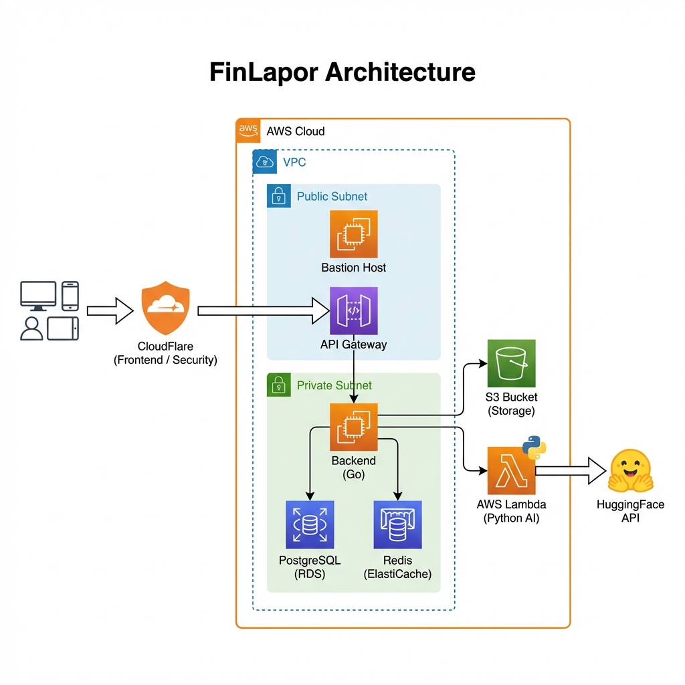

# LAPORAN AKHIR PROYEK (UAS)
**FinLapor: Platform Manajemen Keuangan Berbasis AI untuk Individu & UMKM**

---

## BAB I: PENDAHULUAN

### 1.1 Latar Belakang
Dalam era digital saat ini, manajemen keuangan yang efektif menjadi kunci keberlangsungan ekonomi, baik bagi individu maupun Usaha Mikro, Kecil, dan Menengah (UMKM). Namun, banyak pelaku usaha dan individu masih mengandalkan pencatatan manual yang rentan terhadap kesalahan (*human error*), memakan waktu, dan sulit untuk dianalisis secara *real-time*. Kesulitan dalam melacak arus kas (*cash flow*) seringkali mengakibatkan keputusan finansial yang kurang tepat.

FinLapor hadir sebagai solusi inovatif yang mengintegrasikan kecerdasan buatan (*Artificial Intelligence*) untuk mengotomatisasi proses tersebut. Dengan memanfaatkan teknologi OCR (*Optical Character Recognition*) untuk pemindaian struk dan AI Chatbot untuk analisis keuangan, FinLapor bertujuan mendigitalisasi dan menyederhanakan manajemen keuangan.

### 1.2 Rumusan Masalah
Berdasarkan latar belakang di atas, rumusan masalah dalam pengembangan sistem ini adalah:
1.  Bagaimana cara meminimalisir input data keuangan manual yang tidak efisien?
2.  Bagaimana menyediakan analisis keuangan yang cerdas dan mudah dipahami oleh pengguna awam?
3.  Bagaimana merancang arsitektur sistem yang aman (*secure*) namun tetap efisien dari segi biaya (*cost-effective*)?

### 1.3 Tujuan
Tujuan dari pengembangan FinLapor adalah:
1.  Membangun aplikasi web manajemen keuangan yang mampu mencatat transaksi secara otomatis melalui pemindaian struk.
2.  Menyediakan asisten virtual berbasis AI untuk memberikan *insight* keuangan.
3.  Mengimplementasikan arsitektur *cloud* yang aman menggunakan AWS Private Subnet untuk melindungi data pengguna.

### 1.4 Dukungan terhadap *Sustainable Development Goals* (SDGs)
Proyek ini mendukung agenda pembangunan berkelanjutan PBB:
*   **SDG 8 (Decent Work and Economic Growth):** Membantu UMKM meningkatkan efisiensi operasional dan produktivitas ekonomi melalui manajemen keuangan yang lebih baik.
*   **SDG 12 (Responsible Consumption and Production):** Memberikan transparansi pola konsumsi kepada pengguna, mendorong perilaku konsumsi yang lebih bertanggung jawab dan efisien.

---

## BAB II: LANDASAN TEORI

### 2.1 Manajemen Keuangan Digital
Manajemen keuangan digital meliputi penggunaan teknologi untuk merencanakan, memantau, dan mengontrol aset moneter. Sistem digital memungkinkan pencatatan yang lebih akurat, pelaporan otomatis, dan akses data *real-time* dibandingkan metode konvensional.

### 2.2 Teknologi *Cloud Computing* & AWS
*Cloud computing* memungkinkan penyediaan sumber daya IT sesuai permintaan melalui internet. Amazon Web Services (AWS) digunakan dalam proyek ini dengan menerapkan konsep **VPC (Virtual Private Cloud)** untuk isolasi jaringan, **EC2** untuk komputasi, dan **S3** untuk penyimpanan objek. Fokus utama arsitektur ini adalah keamanan data melalui segmentasi jaringan (*subnetting*).

### 2.3 *Artificial Intelligence* dalam FinTech
Penerapan AI dalam teknologi finansial (FinTech) mencakup:
*   **OCR (Optical Character Recognition):** Mengubah gambar teks (seperti struk belanja) menjadi data digital yang dapat diolah.
*   **LLM (Large Language Model):** Model bahasa besar yang digunakan untuk menafsirkan pertanyaan pengguna dan memberikan analisis kontekstual dalam bentuk *chatbot*.

---

## BAB III: METODOLOGI PENELITIAN

### 3.1 Model Pengembangan
Pengembangan sistem menggunakan metode **Agile**, yang memungkinkan iterasi cepat dan adaptasi terhadap perubahan kebutuhan selama proses pengembangan.

### 3.2 Alat dan Bahan (Tech Stack)
Sistem dibangun menggunakan teknologi modern:
*   **Backend:** Go (Golang) v1.21 dengan Framework Fiber v2. Dipilih karena kecepatan eksekusi dan konkurensi yang tinggi.
*   **Frontend:** Next.js 14 (TypeScript) dengan Tailwind CSS dan shadcn/ui untuk antarmuka yang responsif.
*   **Database:** PostgreSQL 16 (Relational DB) untuk data transaksi, dan Redis 7 untuk *caching* sesi pengguna.
*   **AI Service:** Python 3.11 Serverless Functions (AWS Lambda) yang mengintegrasikan model HuggingFace (Donut & Mistral 7B).
*   **Infrastruktur:** AWS (EC2, S3, VPC), CloudFlare (CDN & Security).

---

## BAB IV: PERANCANGAN DAN IMPLEMENTASI SISTEM

### 4.1 Arsitektur Sistem (Deployment Option B)
Untuk menjamin keamanan dan skalabilitas, FinLapor menerapkan **Arsitektur Private Subnet** di AWS.

*Gambar 4.1: Arsitektur AWS FinLapor (Opsi B: Private Subnet)*

#### 4.1.1 Desain Jaringan (Network Design)
Sistem berjalan di dalam AWS Region `ap-southeast-1` dengan konfigurasi VPC `10.0.0.0/16`. Jaringan dibagi menjadi dua zona utama:

1.  **Public Subnet:**
    *   Berisi **Bastion Host (t3.nano)**: Berfungsi sebagai *jump server* untuk akses SSH yang aman. Administrator tidak dapat mengakses server backend secara langsung dari internet, melainkan harus melalui Bastion ini.
    *   Berisi **API Gateway**: Bertindak sebagai pintu gerbang trafik HTTP dari internet menuju backend privat.

2.  **Private Subnet (Terisolasi):**
    *   Berisi **Backend Server (EC2 t3.micro)**: Menjalankan aplikasi Go Fiber.
    *   Berisi **Database (PostgreSQL & Redis)**: Dijalankan sebagai Docker container di dalam instance backend untuk efisiensi biaya. Subnet ini **tidak memiliki akses langsung dari internet**, sehingga database terlindungi dari serangan eksternal.

#### 4.1.2 Penyimpanan & Integrasi
*   **Frontend Deployment**: Menggunakan **CloudFlare Pages** untuk hosting statis (biaya gratis) yang terhubung ke backend melalui API Gateway.
*   **Object Storage**: Menggunakan **AWS S3** yang diakses melalui **VPC Endpoint**. Ini adalah strategi optimasi biaya kunci, menghindari penggunaan NAT Gateway yang mahal (~$32/bulan) untuk lalu lintas data internal ke S3.

### 4.2 Implementasi Fitur AI
*   **Scan Struk (OCR)**: Saat pengguna mengunggah foto struk, backend mengirimkan gambar ke layanan AI (Python Lambda). Model **Donut (Document Understanding Transformer)** dari HuggingFace, yang di-*fine-tune* untuk dokumen struk, mengekstrak data tanggal, total belanja, dan *merchant*.
*   **Chatbot Keuangan**: Menggunakan model **Mistral 7B**. Pengguna dapat bertanya "Berapa pengeluaran makan saya bulan ini?", dan sistem akan melakukan *query* ke database lalu menyusun jawaban naratif menggunakan LLM.

---

## BAB V: PENGUJIAN DAN ANALISIS

### 5.1 Analisis Keamanan
Arsitektur yang diterapkan memberikan lapisan keamanan bertingkat (*defense in depth*):
1.  **Isolasi Jaringan**: Database dan logika bisnis utama berada di *Private Subnet* yang tidak dapat dijangkau (ping/connect) dari internet publik.
2.  **Akses Terkontrol**: SSH hanya bisa dilakukan melalui Bastion Host dengan *key pair* yang valid dan whitelist IP.
3.  **Proteksi DDoS**: CloudFlare Proxy di depan sistem melindungi dari serangan *Distributed Denial of Service* sebelum trafik mencapai server AWS.

### 5.2 Analisis Biaya (Cost Optimization Strategy)
Salah satu tantangan pengembangan sistem cloud adalah biaya. FinLapor menerapkan strategi efisiensi tinggi:

| Komponen | Strategi Penghematan | Estimasi Biaya/Bulan |
|----------|----------------------|----------------------|
| **Frontend** | Menggunakan CloudFlare Pages (Tier Gratis) | $0 |
| **Backend Compute** | Menggunakan EC2 t3.micro (Eligible Free Tier/Low Cost) | ~$8.50 |
| **Bastion Host** | Menggunakan EC2 t3.nano (Spek paling minimal) | ~$3.80 |
| **Data Transfer** | Menggunakan **VPC Endpoint S3** (Gratis) menggantikan NAT Gateway | Hemat ~$32.00 |
| **AI Inference** | Menggunakan HuggingFace Inference API (Free Tier) | $0 |
| **Total** | | **~$12.30 - $13.00** |

Strategi ini membuktikan bahwa arsitektur *enterprise-grade* (aman dan terisolasi) dapat diimplementasikan dengan biaya yang sangat terjangkau untuk skala tugas akhir atau startup tahap awal.

---

## BAB VI: KESIMPULAN

Pengembangan FinLapor berhasil menghadirkan solusi manajemen keuangan yang tidak hanya fungsional tetapi juga cerdas dan aman. Dengan mengintegrasikan teknologi AI (OCR & LLM) dan arsitektur *cloud* berbasis keamanan (Private Subnet), sistem ini mampu:
1.  Mengotomatisasi pencatatan transaksi melalui struk.
2.  Memberikan perlindungan data pengguna yang lebih baik dibanding arsitektur monolitik sederhana.
3.  Berjalan dengan biaya operasional yang sangat rendah berkat strategi pemilihan infrastruktur yang tepat.

Proyek ini telah memenuhi tujuan utama dan berkontribusi nyata terhadap pencapaian SDGs melalui teknologi finansial yang inklusif.

---
*Dibuat untuk memenuhi tugas akhir mata kuliah Pengembangan Aplikasi Web Lanjut.*
