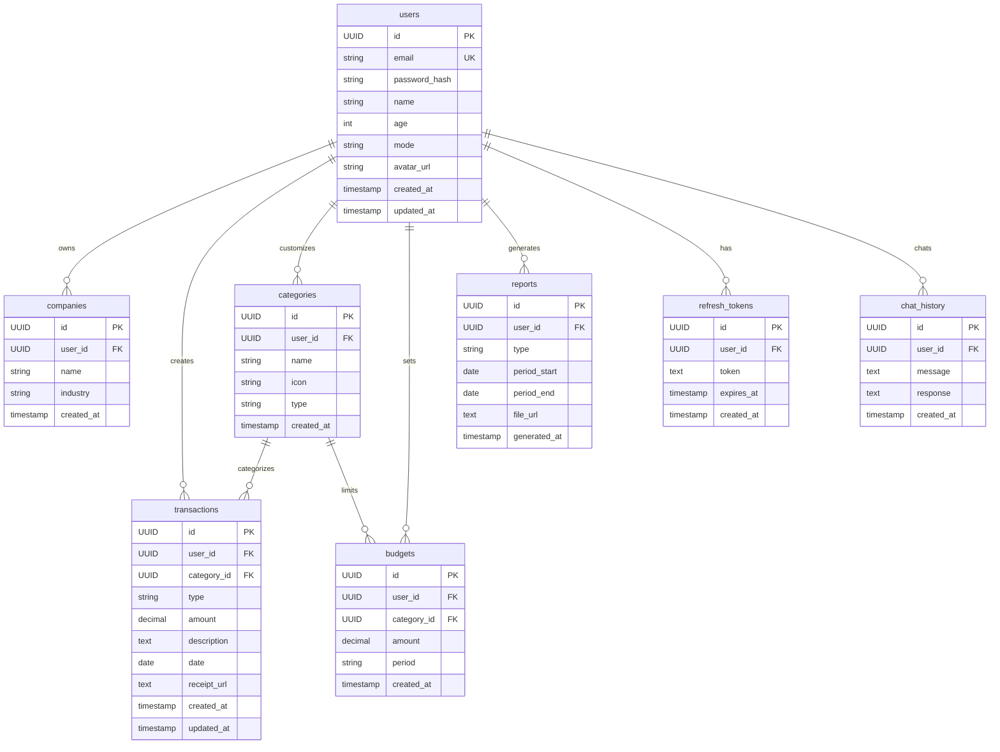

# 🏗️ Architecture

Dokumentasi lengkap arsitektur sistem FinLapor.

---

## 📊 High-Level Architecture

``````

                                     ┌─────────────────┐
                                     │      USER       │
                                     │  (Browser/App)  │
                                     └────────┬────────┘
                                              │
                            ┌─────────────────┴─────────────────┐
                            │                                   │
                            ▼                                   ▼
               ┌─────────────────────────────┐    ┌─────────────────────────────┐
               │      CLOUDFLARE PAGES       │    │      CLOUDFLARE PROXY       │
               │                             │    │                             │
               │   📍 finlapor.airi.click           │    │   📍 api.finlapor.airi.click       │
               │   Next.js Static Export     │    │   DDoS + SSL + Caching      │
               │   FREE                      │    │   FREE                      │
               └─────────────────────────────┘    └──────────────┬──────────────┘
                                                                 │
               ┌─────────────────────────────────────────────────┼──────────────┐
               │                       AWS VPC                   │              │
               │                                                 ▼              │
               │                              ┌──────────────────────────────┐  │
               │                              │   API GATEWAY (HTTP)         │  │
               │                              │   ~$1/million requests       │  │
               │                              └──────────────┬───────────────┘  │
               │                                             │ VPC Link         │
               │  ┌────────────────────┐                     │                  │
               │  │   PUBLIC SUBNET    │                     │                  │
               │  │                    │                     │                  │
               │  │  ┌──────────────┐  │                     │                  │
               │  │  │ Bastion Host │  │                     │                  │
               │  │  │ (t3.nano)    │──┼─────SSH────┐        │                  │
               │  │  │ ~$3.80/mo    │  │            │        │                  │
               │  │  └──────────────┘  │            │        │                  │
               │  │         ▲          │            │        │                  │
               │  │       SSH          │            │        │                  │
               │  │     (Your IP)      │            │        │                  │
               │  └────────────────────┘            │        │                  │
               │                                    │        │                  │
               │  ┌─────────────────────────────────┼────────┼───────────────┐  │
               │  │          PRIVATE SUBNET         │        │               │  │
               │  │                                 │        ▼               │  │
               │  │   │   Backend (Go)       │      │  ┌─────────────────┐  │  │
               │  │   │   EC2 t3.micro       │◄─────┴─►│  AWS RDS        │  │  │
               │  │   │   Fiber API          │         │  PostgreSQL     │  │  │
               │  │   │   ~$8.50/month       │         │  + Redis Docker │  │  │
               │  │   └──────────┬───────────┘         └─────────────────┘  │  │
               │  │              │                                          │  │
               │  │              │ VPC Endpoint ────────────────┐           │  │
               │  │              │ (S3 Gateway - FREE)          │           │  │
               │  └──────────────┼──────────────────────────────┼───────────┘  │
               │                 │                              │              │
               │                 │ AWS SDK (internal)           │              │
               │                 ▼                              ▼              │
               │      ┌───────────────────────┐      ┌───────────────────────┐  │
               │      │      AWS LAMBDA       │      │        AWS S3         │  │
               │      │   (AI Service)        │      │   (File Storage)      │  │
               │      │   Python 3.11         │◄─────┤   ~$0.10/month        │  │
               │      │   FREE tier           │      │                       │  │
               │      └───────────┬───────────┘      └───────────────────────┘  │
               │                  │                                             │
               └──────────────────┼─────────────────────────────────────────────┘
                                  │
                                  ▼
                     ┌───────────────────────────┐
                     │    🤗 HUGGING FACE API    │
                     │    OCR + LLM Models       │
                     │    FREE (30k req/month)   │
                     └───────────────────────────┘
``````

**�� Architecture Highlights:**
- **Bastion Host**: SSH jump host in public subnet for secure access
- **VPC Endpoint S3**: FREE gateway endpoint (saves $32/month by replacing NAT Gateway)
- **Private Subnet**: Backend isolated from internet, only accessible via API Gateway
- **Total Cost**: ~$13/month (EC2 $8.50 + Bastion $3.80 + API Gateway $1)

---

## 🔧 Tech Stack Detail

### Frontend

| Technology | Purpose |
|------------|---------|
| **Next.js 14** | React framework with App Router |
| **TypeScript** | Type safety |
| **Tailwind CSS** | Utility-first styling |
| **shadcn/ui** | UI component library |
| **Zustand** | State management |
| **React Query** | Server state & caching |
| **Recharts** | Data visualization |
| **React Hook Form** | Form handling |
| **Zod** | Schema validation |

### Backend

| Technology | Purpose |
|------------|---------|
| **Go 1.21** | Programming language |
| **Fiber v2** | Web framework |
| **GORM** | ORM for database |
| **AWS RDS PostgreSQL 16** | Primary database (Managed) |
| **Redis 7** | Caching & sessions |
| **JWT** | Authentication |
| **AWS SDK** | S3, Lambda, RDS integration |

### AI Service

| Technology | Purpose |
|------------|---------|
| **Python 3.11** | Programming language |
| **AWS Lambda** | Serverless compute |
| **Hugging Face** | AI model inference |
| **Donut** | OCR for receipts |
| **Mistral-7B** | LLM for chat & categorization |

---

## 📁 Project Structure

```
finlapor/
│
├── 📂 frontend/                    # Next.js Application
│   ├── src/
│   │   ├── app/                    # App Router pages
│   │   │   ├── (auth)/             # Auth pages (login, register)
│   │   │   ├── (dashboard)/        # Protected pages
│   │   │   │   ├── page.tsx        # Dashboard home
│   │   │   │   ├── transactions/
│   │   │   │   ├── scanner/
│   │   │   │   ├── reports/
│   │   │   │   ├── chat/
│   │   │   │   └── settings/
│   │   │   └── layout.tsx
│   │   ├── components/
│   │   │   ├── ui/                 # shadcn components
│   │   │   ├── layout/             # Layout components
│   │   │   ├── charts/             # Chart components
│   │   │   └── forms/              # Form components
│   │   ├── lib/                    # Utilities
│   │   ├── hooks/                  # Custom hooks
│   │   ├── services/               # API services
│   │   └── stores/                 # Zustand stores
│   ├── public/
│   ├── package.json
│   └── next.config.js
│
├── 📂 backend/                     # Go API Server
│   ├── cmd/
│   │   ├── server/
│   │   │   └── main.go             # Entry point
│   │   └── migrate/
│   │       └── main.go             # Migration tool
│   ├── internal/
│   │   ├── config/                 # Configuration
│   │   ├── handlers/               # HTTP handlers
│   │   ├── middleware/             # Middleware
│   │   ├── models/                 # Data models
│   │   ├── repository/             # Database access
│   │   └── services/               # Business logic
│   ├── pkg/                        # Shared packages
│   ├── go.mod
│   └── Dockerfile
│
├── 📂 ai-service/                  # Lambda Functions
│   ├── handlers/
│   │   ├── ocr.py
│   │   ├── categorize.py
│   │   └── chat.py
│   ├── lambda_function.py
│   ├── requirements.txt
│   └── serverless.yml
│
├── 📂 database/
│   ├── migrations/                 # SQL migrations
│   └── migrations/                 # SQL migrations (production-ready)
│
├── 📂 docker/
│   ├── Dockerfile.frontend
│   ├── Dockerfile.backend
│   └── nginx.conf
│
├── 📂 docs/                        # Documentation
│
├── 📂 scripts/                     # Utility scripts
│
├── docker-compose.yml
├── docker-compose.prod.yml
├── Makefile
├── .env.example
└── README.md
```

---

## 🗄️ Database Schema

### Entity Relationship Diagram



### Tables Overview

| Table | Description | Key Relations |
|-------|-------------|---------------|
| `users` | User accounts | Base table |
| `companies` | Business mode companies | → users |
| `categories` | Transaction categories (system + custom) | → users |
| `transactions` | Income/expense records | → users, → categories |
| `budgets` | Category spending limits | → users, → categories |
| `reports` | Generated financial reports | → users |
| `refresh_tokens` | JWT refresh tokens | → users |
| `chat_history` | AI chat conversations | → users |

### Key Relationships

| Parent | Child | Relationship | On Delete |
|--------|-------|--------------|-----------|
| users | transactions | 1:N | CASCADE |
| users | categories | 1:N | CASCADE |
| users | companies | 1:N | CASCADE |
| users | budgets | 1:N | CASCADE |
| users | reports | 1:N | CASCADE |
| users | refresh_tokens | 1:N | CASCADE |
| users | chat_history | 1:N | CASCADE |
| categories | transactions | 1:N | SET NULL |
| categories | budgets | 1:N | CASCADE |

### Tables Detail

#### users
```sql
CREATE TABLE users (
    id UUID PRIMARY KEY DEFAULT uuid_generate_v4(),
    email VARCHAR(255) UNIQUE NOT NULL,
    password_hash VARCHAR(255) NOT NULL,
    name VARCHAR(255) NOT NULL,
    age INTEGER,  -- untuk personalisasi AI
    mode VARCHAR(20) DEFAULT 'personal', -- 'personal' or 'business'
    avatar_url TEXT,
    created_at TIMESTAMP DEFAULT CURRENT_TIMESTAMP,
    updated_at TIMESTAMP DEFAULT CURRENT_TIMESTAMP
);
```

#### categories
```sql
CREATE TABLE categories (
    id UUID PRIMARY KEY DEFAULT uuid_generate_v4(),
    user_id UUID REFERENCES users(id) ON DELETE CASCADE, -- NULL = system default
    name VARCHAR(100) NOT NULL,
    icon VARCHAR(50),
    type VARCHAR(20) NOT NULL, -- 'income', 'expense', or 'both'
    created_at TIMESTAMP DEFAULT CURRENT_TIMESTAMP
);
```

#### transactions
```sql
CREATE TABLE transactions (
    id UUID PRIMARY KEY DEFAULT uuid_generate_v4(),
    user_id UUID REFERENCES users(id) ON DELETE CASCADE,
    category_id UUID REFERENCES categories(id) ON DELETE SET NULL,
    type VARCHAR(20) NOT NULL, -- 'income' or 'expense'
    amount DECIMAL(15,2) NOT NULL,
    description TEXT,
    date DATE NOT NULL,
    receipt_url TEXT,
    created_at TIMESTAMP DEFAULT CURRENT_TIMESTAMP,
    updated_at TIMESTAMP DEFAULT CURRENT_TIMESTAMP
);
```

#### budgets
```sql
CREATE TABLE budgets (
    id UUID PRIMARY KEY DEFAULT uuid_generate_v4(),
    user_id UUID REFERENCES users(id) ON DELETE CASCADE,
    category_id UUID REFERENCES categories(id) ON DELETE CASCADE,
    amount DECIMAL(15,2) NOT NULL,
    period VARCHAR(20) DEFAULT 'monthly',
    created_at TIMESTAMP DEFAULT CURRENT_TIMESTAMP
);
```

#### chat_history
```sql
CREATE TABLE chat_history (
    id UUID PRIMARY KEY DEFAULT uuid_generate_v4(),
    user_id UUID REFERENCES users(id) ON DELETE CASCADE,
    message TEXT NOT NULL,
    response TEXT NOT NULL,
    created_at TIMESTAMP DEFAULT CURRENT_TIMESTAMP
);
```

### Indexes

```sql
CREATE INDEX idx_transactions_user_id ON transactions(user_id);
CREATE INDEX idx_transactions_date ON transactions(date);
CREATE INDEX idx_transactions_category_id ON transactions(category_id);
CREATE INDEX idx_categories_user_id ON categories(user_id);
CREATE INDEX idx_reports_user_id ON reports(user_id);
CREATE INDEX idx_budgets_user_id ON budgets(user_id);
CREATE INDEX idx_chat_history_user_id ON chat_history(user_id);
```

### Default Categories

System menyediakan kategori default (user_id = NULL):

| Name | Icon | Type |
|------|------|------|
| Gaji | 💰 | income |
| Freelance | 💼 | income |
| Investasi | 📈 | income |
| Makanan | 🍔 | expense |
| Transport | 🚗 | expense |
| Belanja | 🛒 | expense |
| Hiburan | 🎮 | expense |
| Tagihan | 📄 | expense |
| Kesehatan | ⚕️ | expense |
| Pendidikan | 📚 | expense |
| Lainnya | 📦 | both |

---

## 🔐 Security

### Authentication Flow

```
1. User login dengan email/password
2. Backend verifikasi credentials
3. Generate JWT access token (15 min) + refresh token (7 days)
4. Client simpan tokens di httpOnly cookies
5. Setiap request, sertakan access token di header
6. Jika expired, gunakan refresh token untuk dapat access token baru
```

### Security Measures

| Layer | Protection |
|-------|------------|
| **Network** | CloudFlare DDoS, VPC Private Subnet |
| **Transport** | HTTPS everywhere (TLS 1.3) |
| **Authentication** | JWT with refresh tokens |
| **Authorization** | Role-based access control |
| **Data** | Password hashing (bcrypt), encrypted at rest |
| **Input** | Validation & sanitization |

---


### VPC Endpoints for Cost Optimization

For the Private Subnet deployment, VPC Endpoints can be used instead of NAT Gateway:

- **S3 Gateway Endpoint**: FREE (no data transfer charges)
- **Saves**: ~$32/month (no NAT Gateway needed)
- **Benefits**: Direct, secure access to S3 from private subnet

### Bastion Host for Private Subnet

When using Private Subnet architecture:

- **Bastion Host**: EC2 t3.nano (~$3.80/month) in public subnet
- **Purpose**: SSH access to backend in private subnet via jump host
- **Security**: Only your IP can SSH to bastion


## 💰 Cost Estimation

| Service | Monthly Cost |
|---------|-------------|
| CloudFlare Pages | $0 (free) |
| CloudFlare Proxy | $0 (free) |
| API Gateway | ~$1-3 |
| EC2 t3.micro | ~$8 |
| S3 (5GB) | ~$0.10 |
| Lambda | ~$0 (free tier) |
| Hugging Face | ~$0 (free tier) |
| **Total** | **~$9-12/month** |

---

## 📚 References

- [Next.js Documentation](https://nextjs.org/docs)
- [Go Fiber Documentation](https://docs.gofiber.io/)
- [AWS Lambda Documentation](https://docs.aws.amazon.com/lambda/)
- [Hugging Face Inference API](https://huggingface.co/docs/api-inference/)


