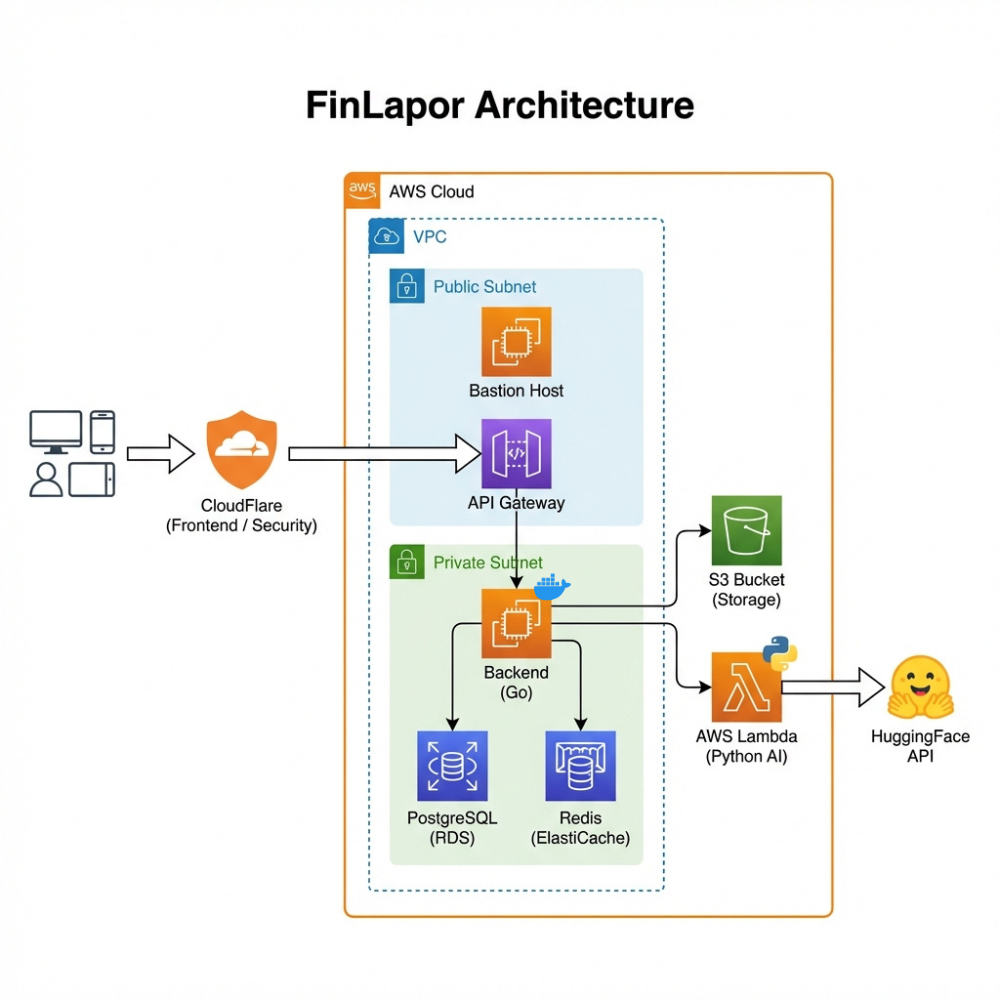

# 🚀 Panduan Deployment FinLapor

Panduan lengkap untuk deploy FinLapor ke production menggunakan **CloudFlare Pages** dan **AWS Cloud**.

> 📌 **Repository**: https://github.com/aan-andiyanaS/finlapor.git

---

## 📊 Arsitektur Target



```
User → CloudFlare (Frontend + Proxy) → API Gateway
                                            │
        ┌───────────────────────────────────┴───────────────────────────────────┐
        │                              AWS VPC                                  │
        │  ┌─────────────────┐                                                  │
        │  │  Public Subnet  │  ← Bastion Host (SSH access)                     │
        │  └────────┬────────┘                                                  │
        │           │                                                           │
        │  ┌────────▼────────────────────────────────────────────────────────┐  │
        │  │                      Private Subnet                             │  │
        │  │  ┌──────────────┐  ┌────────────┐  ┌──────────────┐             │  │
        │  │  │ EC2 Backend  │──│  AWS RDS   │  │ ElastiCache  │             │  │
        │  │  │ (Docker Go)  │  │ PostgreSQL │  │   (Redis)    │             │  │
        │  │  └──────┬───────┘  └────────────┘  └──────────────┘             │  │
        │  └─────────┼───────────────────────────────────────────────────────┘  │
        │            │                                                          │
        │  ┌─────────▼─────────┐  ┌────────────┐                               │
        │  │   AWS Lambda      │──│   AWS S3   │                               │
        │  │   (Python AI)     │  │  (Storage) │                               │
        │  └───────────────────┘  └────────────┘                               │
        └───────────────────────────────────────────────────────────────────────┘
```

---

## 🎯 Pilih Jalur Deployment

### Perbandingan Arsitektur

| Aspek | Opsi A: Public Subnet | Opsi B: Private Subnet |
|-------|----------------------|------------------------|
| **Keamanan** | ⚠️ Standar | ✅ Tinggi (Enterprise-grade) |
| **Biaya/bulan** | ~$9-15 | ~$13-20 |
| **Kompleksitas** | 🟢 Mudah | 🟡 Menengah |
| **SSH Access** | Langsung ke EC2 | Via Bastion Host |
| **Backend** | Terekspos internet | Tersembunyi di private subnet |
| **Sesuai Diagram** | ❌ Tidak | ✅ Ya |
| **Rekomendasi** | MVP/Demo cepat | **Production/UAS** |

### Flowchart Pemilihan

```
                    ┌─────────────────────────────────┐
                    │ Apakah butuh keamanan tinggi?   │
                    │ (Production/Sesuai arsitektur)  │
                    └───────────────┬─────────────────┘
                                    │
                    ┌───────────────┴───────────────┐
                    │                               │
                    ▼                               ▼
              ┌─────────┐                    ┌─────────┐
              │   YA    │                    │  TIDAK  │
              └────┬────┘                    └────┬────┘
                   │                              │
                   ▼                              ▼
        ┌─────────────────────┐      ┌─────────────────────┐
        │  OPSI B: Private    │      │  OPSI A: Public     │
        │  - Private Subnet   │      │  - Public Subnet    │
        │  - Bastion Host     │      │  - Direct SSH       │
        │  - API Gateway      │      │  - Simple setup     │
        └─────────────────────┘      └─────────────────────┘
```

---

## 📋 Tahapan Deployment

Ikuti panduan sesuai urutan. Setiap tahap memiliki file terpisah dengan penjelasan detail.

### Fase 1: Persiapan

| Step | Panduan | Estimasi | Deskripsi |
|------|---------|----------|-----------|
| 1 | [📦 Prerequisites](./deployment/01-prerequisites.md) | 15 menit | Tools & akun yang dibutuhkan |
| 2 | [🔐 AWS Account Setup](./deployment/02-aws-account-setup.md) | 20 menit | IAM user, AWS CLI |

### Fase 2: Infrastructure AWS

| Step | Panduan | Opsi A | Opsi B | Deskripsi |
|------|---------|--------|--------|-----------|
| 3 | [🌐 VPC Setup](./deployment/03-vpc-setup.md) | Public only | Public + Private | Network configuration |
| 4 | [🗄️ RDS Setup](./deployment/04-rds-setup.md) | Sama | Sama | PostgreSQL database |
| 5 | [📁 S3 Setup](./deployment/05-s3-setup.md) | Sama | Sama | Object storage |
| 6 | [🖥️ EC2 Backend](./deployment/06-ec2-backend-setup.md) | Public subnet | Private subnet | Go API server |
| 6b | [🔀 API Gateway](./deployment/06b-api-gateway-setup.md) | Opsional | Recommended | Unified API endpoint |
| 7 | [🤖 Lambda AI](./deployment/07-lambda-ai-setup.md) | Sama | Sama | Python AI service |

### Fase 3: Frontend & Domain

| Step | Panduan | Estimasi | Deskripsi |
|------|---------|----------|-----------|
| 8 | [☁️ CloudFlare Setup](./deployment/08-cloudflare-setup.md) | 30 menit | Frontend hosting & API proxy |
| 9 | [🔗 Domain & SSL](./deployment/09-domain-ssl-setup.md) | 15 menit | Custom domain configuration |

### Fase 4: Maintenance

| Step | Panduan | Deskripsi |
|------|---------|-----------|
| 10 | [📊 Monitoring](./deployment/10-monitoring.md) | CloudWatch, alerts, logs |
| - | [🔧 Troubleshooting](./deployment/troubleshooting.md) | Common issues & solutions |

---

## ⚡ Quick Start Checklist

### Opsi B (Recommended - Sesuai Arsitektur)

**Prerequisites:**
- [ ] AWS Account dengan kartu kredit terverifikasi
- [ ] CloudFlare Account
- [ ] GitHub Account dengan repository FinLapor
- [ ] Domain (opsional, bisa pakai `.pages.dev`)

**Infrastructure:**
- [ ] VPC dengan 2 AZ (Public + Private subnets)
- [ ] Bastion Host di Public Subnet
- [ ] RDS PostgreSQL di Private Subnet
- [ ] S3 Bucket untuk storage
- [ ] EC2 Backend di Private Subnet dengan Docker

**Deploy:**
- [ ] Lambda function untuk AI service
- [ ] CloudFlare Pages untuk frontend
- [ ] DNS records untuk API subdomain
- [ ] SSL/TLS configured

**Verify:**
- [ ] Frontend accessible: `https://finlapor.pages.dev`
- [ ] API healthcheck: `https://api.finlapor.airi.click/health`
- [ ] Login dengan demo account: `demo@finlapor.airi.click` / `demo123`

---

## 💰 Estimasi Biaya

| Service | Opsi A | Opsi B | Catatan |
|---------|--------|--------|---------|
| EC2 t3.micro | $8.50 | $8.50 | Backend |
| EC2 t3.nano | - | $3.80 | Bastion (Opsi B only) |
| RDS db.t3.micro | $15-25 | $15-25 | Free tier 12 bulan |
| S3 (5GB) | $0.10 | $0.10 | - |
| API Gateway | - | $1-3 | Per million requests |
| Lambda | $0 | $0 | Free tier |
| CloudFlare | $0 | $0 | Pages + Proxy |
| **Total** | **~$24-34** | **~$28-40** | Per bulan |

> 💡 **Tips Hemat:**
> - Gunakan Free Tier AWS (12 bulan pertama)
> - Stop EC2 saat tidak dipakai (malam/weekend)
> - RDS bisa diganti PostgreSQL di EC2 untuk demo

---

## 📚 Panduan Lengkap

### Per Tahap (Recommended)
- [01. Prerequisites](./deployment/01-prerequisites.md)
- [02. AWS Account Setup](./deployment/02-aws-account-setup.md)
- [03. VPC Setup](./deployment/03-vpc-setup.md)
- [04. RDS Setup](./deployment/04-rds-setup.md)
- [05. S3 Setup](./deployment/05-s3-setup.md)
- [06. EC2 Backend Setup](./deployment/06-ec2-backend-setup.md)
- [06b. API Gateway Setup](./deployment/06b-api-gateway-setup.md) 🆕 **NEW**
- [07. Lambda AI Setup](./deployment/07-lambda-ai-setup.md)
- [08. CloudFlare Setup](./deployment/08-cloudflare-setup.md) ⭐ **Detailed**
- [09. Domain & SSL Setup](./deployment/09-domain-ssl-setup.md)
- [10. Monitoring](./deployment/10-monitoring.md)

### Referensi
- [Troubleshooting Guide](./deployment/troubleshooting.md)
- [Architecture Documentation](./architecture.md)
- [Development Guide](./development.md)

---

## 🆘 Butuh Bantuan?

1. Cek [Troubleshooting Guide](./deployment/troubleshooting.md)
2. Lihat [GitHub Issues](https://github.com/aan-andiyanaS/finlapor/issues)
3. Baca dokumentasi resmi:
   - [AWS Documentation](https://docs.aws.amazon.com/)
   - [CloudFlare Docs](https://developers.cloudflare.com/)
