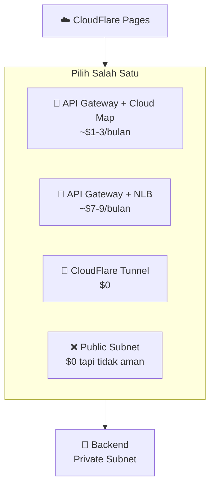
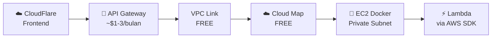
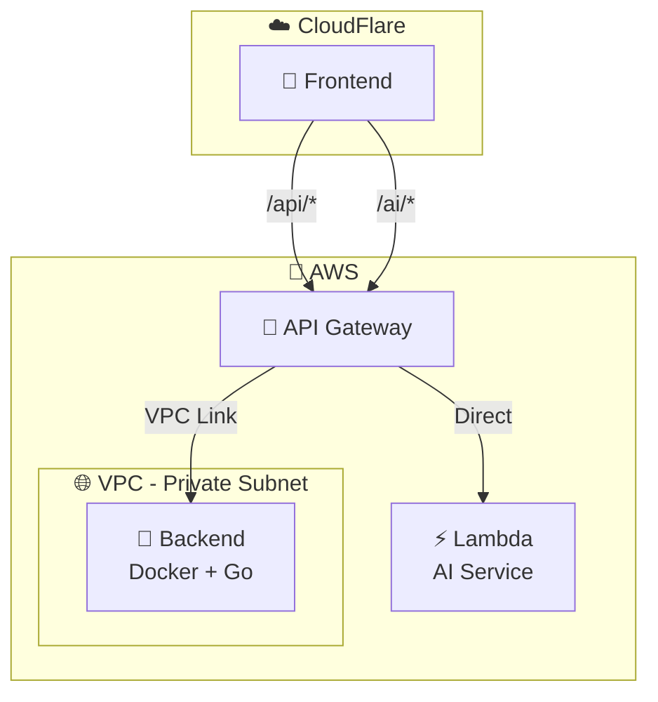
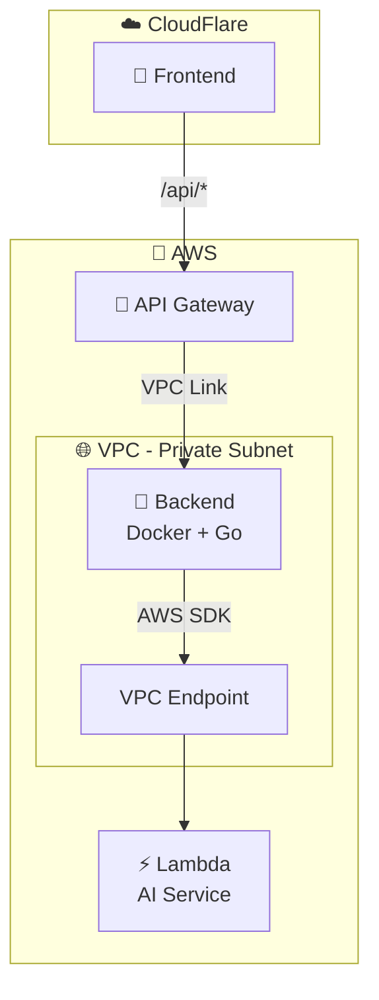
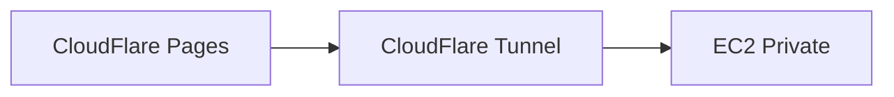

# 🔀 Setup AWS API Gateway

Panduan membuat API Gateway untuk menghubungkan **CloudFlare Pages** ke **Backend di Private Subnet**.

> **📌 Penting:** API Gateway ini **hanya** untuk akses ke Backend. Lambda dipanggil langsung dari Backend via AWS SDK.

---

## 📑 Daftar Isi

1. [Overview](#overview)
2. [Pilih Arsitektur](#-pilih-arsitektur)
   - [Opsi A: API Gateway → Backend + Lambda](#opsi-a-api-gateway--backend--lambda)
   - [Opsi B: API Gateway → Backend saja](#opsi-b-api-gateway--backend-saja-recommended)
3. [Perbandingan](#perbandingan)
4. [Panduan Setup Opsi A](#panduan-setup-opsi-a-backend--lambda)
5. [Panduan Setup Opsi B](#panduan-setup-opsi-b-backend-saja)
6. [Create HTTP API](#1-create-http-api)
7. [Setup NLB](#2-setup-nlb-network-load-balancer)
8. [VPC Link Setup](#3-vpc-link-setup)
9. [Integrasi dengan Backend](#4-integrasi-dengan-backend)
10. [Custom Domain](#5-custom-domain)
11. [CORS Configuration](#6-cors-configuration)
12. [Authentication](#7-authentication)
13. [Monitoring & Logging](#8-monitoring--logging)
14. [Troubleshooting](#9-troubleshooting)

---

## Overview

Backend di **Private Subnet** BUTUH "entry point" untuk bisa diakses dari internet.

### Semua Opsi Koneksi CloudFlare → Backend Private Subnet



### Perbandingan Detail

| Opsi | Biaya/bulan | Keamanan | Setup | API Gateway |
|------|-------------|----------|-------|-------------|
| **🥇 API Gateway + Cloud Map** | **~$1-3** | ✅ Tinggi | 🟡 Menengah | ✅ Ya |
| 🥈 API Gateway + NLB | ~$7-9 | ✅ Tinggi | 🟡 Menengah | ✅ Ya |
| 🥉 CloudFlare Tunnel | $0 | ✅ Tinggi | 🟡 Menengah | ❌ Tidak |
| ❌ Public Subnet + EIP | $0 | ⚠️ Rendah | 🟢 Mudah | ❌ Tidak perlu |

> **💡 Rekomendasi:** Gunakan **API Gateway + Cloud Map** - biaya minimal dengan fitur API Gateway lengkap!

---

## 🎯 Arsitektur Utama: API Gateway + Cloud Map



**Biaya breakdown:**
| Komponen | Biaya |
|----------|-------|
| API Gateway HTTP API | ~$1-3/bulan (per juta requests) |
| VPC Link | **FREE** |
| Cloud Map | **FREE** (1M queries gratis) |
| **Total** | **~$1-3/bulan** |

---

## 🎯 Pilih Arsitektur

### Opsi A: API Gateway → Backend + Lambda

Frontend bisa akses Backend **dan** Lambda langsung via API Gateway.



| Route | Target |
|-------|--------|
| `/api/*` | Backend (via VPC Link) |
| `/ai/*` | Lambda (langsung) |

**Keuntungan:**
- ✅ Frontend bisa akses Lambda tanpa melalui Backend
- ✅ Latency lebih rendah untuk AI calls
- ✅ Backend tidak perlu VPC Endpoint Lambda

**Kekurangan:**
- ⚠️ Setup lebih kompleks (2 integrations)

---

### Opsi B: API Gateway → Backend saja (Recommended)

API Gateway hanya ke Backend. Lambda dipanggil dari Backend via AWS SDK.



| Route | Target |
|-------|--------|
| `/api/*` | Backend (via VPC Link) |
| AI calls | Backend → Lambda (AWS SDK) |

**Keuntungan:**
- ✅ Setup lebih simple (1 integration)
- ✅ Auth terpusat di Backend
- ✅ Logging terpusat

**Kekurangan:**
- ⚠️ Butuh VPC Endpoint untuk Lambda (~$7.5/bulan)

---

## Perbandingan

| Aspek | Opsi A (Backend + Lambda) | Opsi B (Backend saja) |
|-------|--------------------------|----------------------|
| **API Gateway routes** | 2 (Backend + Lambda) | 1 (Backend) |
| **Lambda access** | Via API Gateway | Via AWS SDK |
| **VPC Endpoint Lambda** | ❌ Tidak perlu | ✅ Diperlukan |
| **Setup** | Lebih kompleks | Lebih simple |
| **Biaya** | API GW ~$1-3 | API GW + VPC Endpoint ~$9 |
| **Latency AI** | Lebih rendah | Sedikit lebih tinggi |

> **💡 Rekomendasi:** Gunakan **Opsi B** untuk setup lebih sederhana dan auth terpusat.

---

## Panduan Setup Opsi A (Backend + Lambda)

Setup Opsi A **sama dengan Opsi B**, tapi dengan langkah tambahan untuk Lambda integration.

### Langkah yang Sama:
1. Create HTTP API ✅
2. Setup VPC Link ✅
3. Create Backend integration ✅
4. Create route `/api/{proxy+}` ✅
5. Custom domain ✅
6. CORS ✅

### Langkah Tambahan untuk Opsi A:

#### Tambah Lambda Integration

1. API Gateway → **finlapor-api** → **Integrations**
2. Click **Create**
3. Konfigurasi:

```
Integration type: AWS Lambda
AWS Region: ap-southeast-1
Lambda function: finlapor-ai
Payload format version: 2.0
```

4. Click **Create**

> **📝 Note:** API Gateway akan otomatis request permission untuk invoke Lambda.

#### Tambah Route untuk AI

1. Routes → **Create**
2. Konfigurasi:

```
Method: ANY
Path: /ai/{proxy+}
```

3. Attach integration: **finlapor-ai Lambda**

#### Test Lambda Route

```bash
# Test health
curl -X POST https://api.finlapor.airi.click/ai/health \
  -H "Content-Type: application/json" \
  -d '{"action": "health"}'

# Test chat
curl -X POST https://api.finlapor.airi.click/ai/chat \
  -H "Content-Type: application/json" \
  -d '{"action": "chat", "message": "Halo", "user_age": 25}'
```

---

## Panduan Setup Opsi B (Backend saja)

Panduan ini menggunakan **Opsi B** (API Gateway ke Backend saja).

---

## 1. Create HTTP API

### Step 1.1: Buka API Gateway Console

1. AWS Console → Search **API Gateway** → Click
2. Pilih region: `ap-southeast-1` (Singapore)

### Step 1.2: Create API

1. Click **Create API**
2. Pilih **HTTP API** → **Build**
3. Konfigurasi:

```
API name: finlapor-api
Description: FinLapor Backend API Gateway
```

4. Click **Next**

### Step 1.3: Skip Routes (untuk sekarang)

Click **Next** (kita akan add routes nanti)

### Step 1.4: Configure Stages

```
Stage name: $default
Auto-deploy: ✅ Enable
```

> **📝 Note:** Stage `$default` berarti tidak ada prefix di URL.

5. Click **Next** → **Create**

### Step 1.5: Catat API Endpoint

Setelah dibuat, catat URL:
```
https://abc123xyz.execute-api.ap-southeast-1.amazonaws.com
```

---

## 2. Setup Cloud Map (Recommended - Gratis!)

> **💡 Cloud Map gratis untuk 1 juta query/bulan** - lebih hemat dari NLB (~$6/bulan)!

### Step 2.1: Create Namespace

1. AWS Console → Search **Cloud Map** → Click
2. Click **Create namespace**
3. Konfigurasi:

```
Namespace name: finlapor-ns
Namespace description: FinLapor Backend Services
Instance discovery: API calls and DNS queries in VPCs
VPC: finlapor-vpc
```

4. Click **Create namespace**

### Step 2.2: Create Service

1. Click namespace **finlapor-ns**
2. Click **Create service**
3. Konfigurasi:

```
Service name: backend
Description: FinLapor Backend Service
Routing policy: Weighted routing

Health check:
  - Enable health check: ❌ (optional)
```

4. Click **Create service**

### Step 2.3: Register EC2 Instance

1. Click service **backend**
2. Click **Register service instance**
3. Konfigurasi:

```
Instance type: IP address
Service instance ID: finlapor-backend-1
IPv4 address: [EC2_PRIVATE_IP]  ← Contoh: 10.0.1.100
Port: 8080
```

4. Click **Register service instance**

> **📝 Untuk mendapat Private IP EC2:**
> EC2 Console → Instances → Pilih backend → Lihat **Private IPv4 address**

---

## 3. VPC Link Setup

### Step 3.1: Create VPC Link

1. API Gateway Console → **VPC links** (sidebar)
2. Click **Create**
3. Pilih **VPC link for HTTP APIs**
4. Konfigurasi:

```
Name: finlapor-vpc-link
VPC: finlapor-vpc
Subnets: 
  - Private Subnet AZ-a
  - Private Subnet AZ-b
Security groups: default atau buat baru
```

5. Click **Create**
6. Tunggu status: **Available** (~3-5 menit)

---

## 4. Integrasi dengan Backend

### Step 4.1: Create Integration

1. API Gateway → **finlapor-api** → **Integrations**
2. Click **Create**
3. Konfigurasi:

**Integration target:**
```
Integration type: Private resource
```

**Integration details:**
```
Selection method: Select manually
Target service: Cloud Map  ← Pilih ini!
Namespace: finlapor-ns
Service: backend
```

**VPC link:**
```
VPC link: finlapor-vpc-link
```

4. Click **Create**

### Step 4.2: Create Route

1. Sidebar: **Routes** → **Create**
2. Konfigurasi:

```
Method: ANY
Path: /api/{proxy+}
```

3. Click **Create**

### Step 4.3: Attach Integration ke Route

1. Click route `/api/{proxy+}`
2. **Attach integration** → Pilih integration NLB
3. Click **Attach integration**

### Step 4.4: Test

```bash
curl https://[API_GATEWAY_URL]/api/health

# Expected:
{
  "status": "ok",
  "service": "finlapor-backend"
}
```

---

## 5. Custom Domain

### Step 4.1: Request Certificate di ACM

1. AWS Console → **Certificate Manager** (ACM)
2. Region: **ap-southeast-1**
3. Click **Request certificate** → **Request a public certificate**
4. Domain: `api.finlapor.airi.click`
5. Validation method: **DNS validation**
6. Click **Request**

### Step 4.2: DNS Validation

1. Lihat **Domains** section pada certificate
2. Copy CNAME record ke CloudFlare DNS:

```
Name: _abc123.api.finlapor
Type: CNAME
Value: _xyz789.acm-validations.aws.
```

3. Tunggu status certificate: **Issued** (~5-30 menit)

### Step 4.3: Setup Custom Domain di API Gateway

1. API Gateway → **Custom domain names** (sidebar)
2. Click **Create**
3. Konfigurasi:

```
Domain name: api.finlapor.airi.click
Endpoint type: Regional
Certificate: Pilih certificate dari ACM

API mapping:
  - API: finlapor-api
  - Stage: $default
  - Path: (kosong)
```

4. Click **Create**

### Step 4.4: Update DNS di CloudFlare

Setelah domain dibuat, catat **API Gateway domain name**:
```
d-abc123xyz.execute-api.ap-southeast-1.amazonaws.com
```

Di CloudFlare DNS, buat CNAME record:

```
Type: CNAME
Name: api
Target: d-abc123xyz.execute-api.ap-southeast-1.amazonaws.com
Proxy status: DNS Only (gray cloud) ← PENTING!
```

> **⚠️ Penting:** Gunakan **DNS Only** (gray cloud), bukan Proxied, karena AWS ACM sudah handle SSL.

### Step 4.5: Test Custom Domain

```bash
curl https://api.finlapor.airi.click/api/health
```

---

## 5. CORS Configuration

### Step 5.1: Enable CORS

1. API Gateway → **finlapor-api** → **CORS** (sidebar)
2. Click **Configure**
3. Konfigurasi:

```
Access-Control-Allow-Origin:
  - https://finlapor.pages.dev
  - https://finlapor.airi.click
  - http://localhost:3000

Access-Control-Allow-Headers:
  - content-type
  - authorization
  - x-requested-with

Access-Control-Allow-Methods:
  - GET
  - POST
  - PUT
  - DELETE
  - OPTIONS

Access-Control-Max-Age: 300

Access-Control-Allow-Credentials: true
```

4. Click **Save**

### Step 5.2: Verify CORS

```bash
curl -X OPTIONS https://api.finlapor.airi.click/api/auth/login \
  -H "Origin: https://finlapor.airi.click" \
  -H "Access-Control-Request-Method: POST" \
  -v

# Lihat response headers:
# Access-Control-Allow-Origin: https://finlapor.airi.click
```

---

## 6. Authentication

### Opsi: Pass-through ke Backend

Untuk FinLapor, autentikasi dihandle oleh **Backend** (JWT):

1. Frontend kirim `Authorization: Bearer <token>` header
2. API Gateway forward header ke Backend
3. Backend validate JWT

**Tidak perlu setup authorizer di API Gateway** - cukup pastikan header di-forward.

### Verifikasi Header Forward

```bash
# Test dengan token
curl https://api.finlapor.airi.click/api/transactions \
  -H "Authorization: Bearer eyJhbGc..."
```

---

## 7. Monitoring & Logging

### Step 7.1: Enable Access Logging

1. API Gateway → **finlapor-api** → **Stages**
2. Click **$default**
3. **Logs and tracing** → Edit
4. Enable **Access logging**
5. Destination ARN: Buat CloudWatch log group

```
Log group: /aws/apigateway/finlapor-api
```

6. Log format (JSON):
```json
{
  "requestId": "$context.requestId",
  "ip": "$context.identity.sourceIp",
  "requestTime": "$context.requestTime",
  "httpMethod": "$context.httpMethod",
  "path": "$context.path",
  "status": "$context.status",
  "responseLatency": "$context.responseLatency"
}
```

### Step 7.2: View Metrics

CloudWatch → Metrics → **ApiGateway**:
- **Count** - Total requests
- **Latency** - Response time
- **4XXError** - Client errors
- **5XXError** - Server errors

---

## 8. Troubleshooting

### Error: 502 Bad Gateway

**Penyebab:**
- VPC Link tidak configured dengan benar
- Backend tidak running
- Security Group blocking traffic

**Solusi:**
1. Cek VPC Link status: Harus **Available**
2. SSH ke EC2 via Bastion, cek: `docker ps`
3. Verify Security Group inbound rules

### Error: 504 Gateway Timeout

**Penyebab:**
- Backend terlalu lambat merespon
- Network connectivity issue

**Solusi:**
1. API Gateway default timeout: 29 detik
2. Check Backend logs: `docker logs finlapor-backend`
3. Verify VPC Link subnets match EC2 subnet

### CORS Error di Browser

**Penyebab:**
- Origin tidak ada di allow list
- Preflight (OPTIONS) gagal

**Solusi:**
1. Tambah origin ke CORS config
2. Verify dengan `curl -X OPTIONS`

### Error: 403 Forbidden

**Penyebab:**
- Route tidak match
- Integration tidak attached

**Solusi:**
1. Check Routes → pastikan `/api/{proxy+}` ada
2. Verify integration attached ke route

---

## Ringkasan Konfigurasi

| Komponen | Value |
|----------|-------|
| API Type | HTTP API |
| Endpoint | `https://api.finlapor.airi.click` |
| Route | `ANY /api/{proxy+}` → Backend:8080 |
| VPC Link | Required (Private Subnet) |
| CORS | Enabled untuk frontend origins |
| Auth | Pass-through ke Backend (JWT) |

---

## Koneksi Backend → Lambda

> **📖 Untuk setup koneksi Backend ke Lambda**, lihat:
> 
> **[07-lambda-ai-setup.md](./07-lambda-ai-setup.md)** - Section 5 & 6:
> - Setup VPC Endpoint untuk Lambda
> - Backend environment variables
> - AWS SDK configuration

Lambda **TIDAK** menggunakan API Gateway. Backend memanggil Lambda langsung via AWS SDK.

---

## Next Steps

Setelah API Gateway selesai:

- → [CloudFlare Setup](./08-cloudflare-setup.md) - Update `NEXT_PUBLIC_API_URL`
- → [Domain & SSL Setup](./09-domain-ssl-setup.md) - Custom domain
- → [Monitoring](./10-monitoring.md) - Setup alerts

---

> **📌 Tips:**
> - Gunakan **HTTP API** untuk menghemat biaya (~$1/juta requests)
> - **Cloud Map gratis** - lebih hemat dari NLB (~$6/bulan)
> - Enable **access logging** untuk debugging
> - Lambda dipanggil dari Backend, bukan dari API Gateway

---

## Alternatif Koneksi (Opsional)

### Alternatif 1: API Gateway + NLB (~$7-9/bulan)

Jika Cloud Map tidak bekerja atau butuh health check:

**Step 1:** Create Target Group
```
EC2 Console → Target Groups → Create
Type: Instances
Port: 8080
Health check: /api/health
```

**Step 2:** Create NLB
```
EC2 Console → Load Balancers → Create
Type: Network Load Balancer
Scheme: Internal
Listener: TCP:80 → Target Group
```

**Step 3:** Integration di API Gateway
```
Target service: ALB/NLB
Load balancer: finlapor-nlb
```

---

### Alternatif 2: CloudFlare Tunnel ($0 - Tanpa API Gateway)

Jika tidak ingin biaya sama sekali:



**Step 1:** Install cloudflared di EC2
```bash
# SSH ke EC2 via Bastion
curl -L https://github.com/cloudflare/cloudflared/releases/latest/download/cloudflared-linux-amd64 -o cloudflared
chmod +x cloudflared
sudo mv cloudflared /usr/local/bin/

# Login
cloudflared tunnel login
```

**Step 2:** Create Tunnel
```bash
cloudflared tunnel create finlapor-backend
cloudflared tunnel route dns finlapor-backend api.finlapor.airi.click
```

**Step 3:** Config file
```yaml
# ~/.cloudflared/config.yml
tunnel: finlapor-backend
credentials-file: /root/.cloudflared/xxx.json

ingress:
  - hostname: api.finlapor.airi.click
    service: http://localhost:8080
  - service: http_status:404
```

**Step 4:** Run as service
```bash
sudo cloudflared service install
sudo systemctl start cloudflared
```

> **⚠️ Catatan:** CloudFlare Tunnel tidak menggunakan API Gateway - kehilangan fitur throttling dan monitoring AWS.
