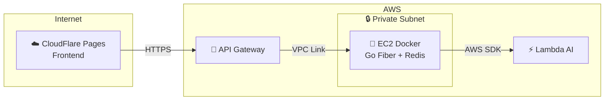
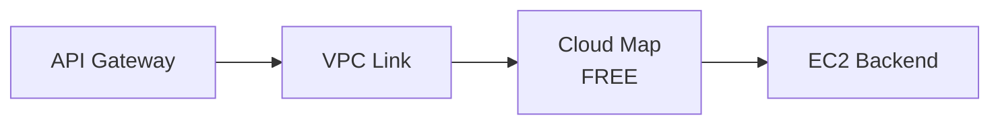
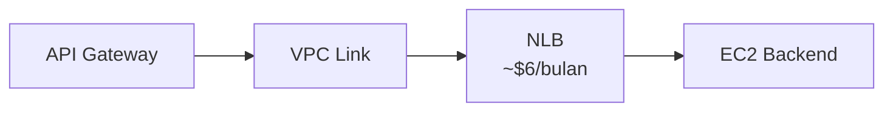
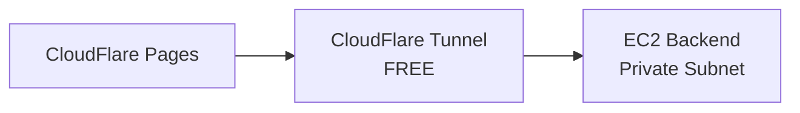
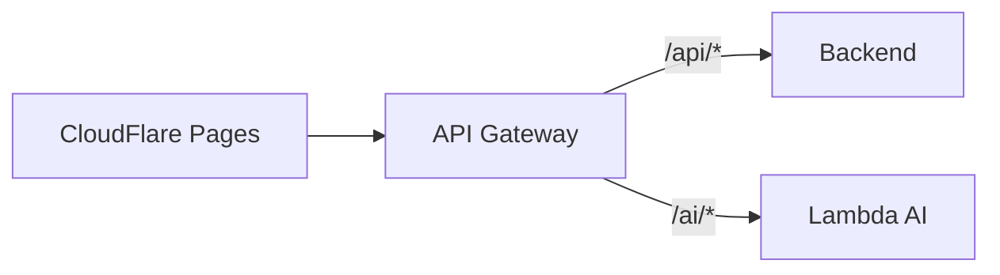

# 🔀 Setup AWS API Gateway

Panduan lengkap untuk menghubungkan **CloudFlare Pages (Frontend)** ke **Backend di Private Subnet** menggunakan AWS API Gateway.

---

## 📑 Daftar Isi

1. [Overview](#overview)
2. [Perbandingan Metode Koneksi](#perbandingan-metode-koneksi)
3. [Rute Utama: API Gateway → Backend Only](#-rute-utama-api-gateway--backend-only)
   - [Opsi 1: Cloud Map (Gratis)](#opsi-1-cloud-map-gratis)
   - [Opsi 2: NLB (~$6/bulan)](#opsi-2-nlb-6bulan)
   - [Opsi 3: CloudFlare Tunnel (Gratis, Tanpa API Gateway)](#opsi-3-cloudflare-tunnel-gratis-tanpa-api-gateway)
4. [Setup API Gateway](#setup-api-gateway)
5. [Custom Domain & CORS](#custom-domain--cors)
6. [Monitoring & Troubleshooting](#monitoring--troubleshooting)
7. [Alternatif: API Gateway → Backend + Lambda](#-alternatif-api-gateway--backend--lambda)

---

## Overview

Backend di **Private Subnet** tidak memiliki public IP, sehingga butuh "entry point" untuk diakses dari internet.

### Arsitektur yang Digunakan



> **📌 Rute Utama:** API Gateway hanya untuk Backend. Lambda dipanggil dari Backend via AWS SDK.

---

## Perbandingan Metode Koneksi

### Untuk Koneksi API Gateway → Backend

| Metode | Biaya/bulan | Kompleksitas | Health Check | Rekomendasi |
|--------|-------------|--------------|--------------|-------------|
| **Cloud Map** | **~$1-3** | 🟡 Menengah | ❌ Manual | ✅ **Paling Hemat** |
| **NLB** | ~$7-9 | 🟡 Menengah | ✅ Auto | Jika butuh auto health check |
| **CloudFlare Tunnel** | **$0** | 🟢 Mudah | ❌ | Jika tidak butuh API Gateway |

### Biaya Total Estimasi

| Setup | API Gateway | Koneksi | Total |
|-------|-------------|---------|-------|
| API Gateway + Cloud Map | ~$1-3 | $0 | **~$1-3/bulan** |
| API Gateway + NLB | ~$1-3 | ~$6 | ~$7-9/bulan |
| CloudFlare Tunnel (No API GW) | $0 | $0 | **$0** |

---

## 🎯 Rute Utama: API Gateway → Backend Only

API Gateway mengarahkan request ke Backend. Backend yang memanggil Lambda via AWS SDK.

### ❓ Kenapa Butuh Cloud Map / NLB?

> **⚠️ Penting:** AWS API Gateway HTTP API dengan VPC Link **TIDAK BISA** langsung terhubung ke EC2 Private IP!

**Alasan teknis:**
- VPC Link adalah "jembatan" antara API Gateway (public) dan Private Subnet
- Tapi VPC Link butuh **service discovery** untuk menemukan target
- AWS menyediakan 2 cara service discovery:
  1. **Cloud Map** - Mendaftarkan IP EC2 secara manual (gratis)
  2. **ALB/NLB** - Load balancer yang otomatis track EC2 (berbayar)

```
❌ API Gateway → VPC Link → EC2 Private IP (TIDAK BISA!)
✅ API Gateway → VPC Link → Cloud Map → EC2 Private IP
✅ API Gateway → VPC Link → NLB → EC2 Private IP
```

**Kesimpulan:** Pilih **Cloud Map** untuk biaya minimal, atau **NLB** jika butuh auto health check.

---

### Opsi 1: Cloud Map (Gratis)

Cloud Map adalah service discovery gratis (1 juta query/bulan gratis).



#### Step 1: Create Namespace

1. Buka **AWS Console** → Search "**Cloud Map**"
2. Click **Create namespace**
3. Isi form:

| Field | Value |
|-------|-------|
| Namespace name | `finlapor-ns` |
| Namespace description | FinLapor Backend Services |
| Instance discovery | **API calls and DNS queries in VPCs** |

4. Pilih **VPC**: `finlapor-vpc`
5. Click **Create namespace**

#### Step 2: Create Service

1. Click namespace **finlapor-ns**
2. Click **Create service**
3. Isi form:

| Field | Value |
|-------|-------|
| Service name | `backend` |
| Description | FinLapor Backend Service |
| Routing policy | Weighted routing |

4. Click **Create service**

#### Step 3: Register EC2 Instance

1. Click service **backend**
2. Click **Register service instance**
3. Isi form:

| Field | Value |
|-------|-------|
| Instance type | **IP address** |
| Service instance ID | `finlapor-backend-1` |
| IPv4 address | `[EC2_PRIVATE_IP]` (contoh: 10.0.1.50) |
| Port | `8080` |

> **📝 Cara dapat Private IP:**
> EC2 Console → Instances → Pilih instance → **Private IPv4 address**

4. Click **Register service instance**

---

### Opsi 2: NLB (~$6/bulan)

Network Load Balancer dengan auto health check.



#### Step 1: Create Target Group

1. **EC2 Console** → **Target Groups** (dibawah Load Balancing)
2. Click **Create target group**
3. Isi form:

| Field | Value |
|-------|-------|
| Target type | **Instances** |
| Target group name | `finlapor-backend-tg` |
| Protocol | TCP |
| Port | 8080 |
| VPC | finlapor-vpc |
| Health check protocol | HTTP |
| Health check path | `/api/health` |

4. Click **Next**
5. **Register targets**: Pilih EC2 backend, port 8080
6. Click **Create target group**

#### Step 2: Create NLB

1. **EC2 Console** → **Load Balancers** → **Create Load Balancer**
2. Pilih **Network Load Balancer**
3. Isi form:

| Field | Value |
|-------|-------|
| Load balancer name | `finlapor-nlb` |
| Scheme | **Internal** ← PENTING! |
| IP address type | IPv4 |
| VPC | finlapor-vpc |
| Mappings | Pilih Private Subnets |

4. **Listeners**:

| Protocol | Port | Default action |
|----------|------|----------------|
| TCP | 80 | Forward to `finlapor-backend-tg` |

5. Click **Create load balancer**
6. Tunggu status: **Active**

---

### Opsi 3: CloudFlare Tunnel (Gratis, Tanpa API Gateway)

Tidak menggunakan API Gateway sama sekali. **Biaya: $0**



> **⚠️ Catatan:** Kehilangan fitur API Gateway (throttling, monitoring AWS, dll).

#### Step 1: Install cloudflared di EC2

```bash
# SSH ke EC2 via Bastion Host
ssh -J ec2-user@[BASTION_IP] ec2-user@[EC2_PRIVATE_IP]

# Download dan install cloudflared
curl -L https://github.com/cloudflare/cloudflared/releases/latest/download/cloudflared-linux-amd64 -o cloudflared
chmod +x cloudflared
sudo mv cloudflared /usr/local/bin/

# Login ke CloudFlare
cloudflared tunnel login
```

#### Step 2: Create Tunnel

```bash
# Create tunnel
cloudflared tunnel create finlapor-backend

# Route DNS
cloudflared tunnel route dns finlapor-backend api.finlapor.airi.click
```

#### Step 3: Create Config

```bash
# Buat config file
cat > ~/.cloudflared/config.yml << EOF
tunnel: finlapor-backend
credentials-file: /home/ec2-user/.cloudflared/[TUNNEL_ID].json

ingress:
  - hostname: api.finlapor.airi.click
    service: http://localhost:8080
  - service: http_status:404
EOF
```

#### Step 4: Run as Service

```bash
sudo cloudflared service install
sudo systemctl enable cloudflared
sudo systemctl start cloudflared

# Verify
sudo systemctl status cloudflared
```

#### Step 5: Test

```bash
curl https://api.finlapor.airi.click/api/health
```

---

## Setup API Gateway

> **📌 Skip section ini jika menggunakan CloudFlare Tunnel (Opsi 3)**

### Step 1: Create HTTP API

1. **AWS Console** → Search "**API Gateway**"
2. Click **Create API**
3. Pilih **HTTP API** → **Build**
4. Isi form:

| Field | Value |
|-------|-------|
| API name | `finlapor-api` |
| Description | FinLapor Backend API |

5. Click **Next** → Skip integrations → **Next**
6. **Stages**: `$default` dengan Auto-deploy enabled
7. Click **Create**

### Step 2: Create VPC Link

1. Sidebar: **VPC links** (dibawah)
2. Click **Create**
3. Pilih **VPC link for HTTP APIs**
4. Isi form:

| Field | Value |
|-------|-------|
| Name | `finlapor-vpc-link` |
| VPC | finlapor-vpc |
| Subnets | Private Subnet AZ-a, Private Subnet AZ-b |
| Security groups | `finlapor-vpc-link-sg` (buat baru) |

5. Click **Create**
6. Tunggu status: **Available** (~3-5 menit)

### Step 2.5: Konfigurasi Security Group (Best Practice)

> **📌 Penting:** VPC Link hanya membuat koneksi **outbound** ke backend. Inbound rules **tidak diperlukan**.

#### Traffic Flow:
```
API Gateway → VPC Link (outbound ke :8080) → Backend
             ←───────────────────────────────
                    (return traffic, otomatis diizinkan)
```

#### Security Group untuk VPC Link (`finlapor-vpc-link-sg`):

**Inbound Rules:**
| Type | Port | Source |
|------|------|--------|
| - | - | ❌ **Kosong** (tidak perlu inbound) |

**Outbound Rules:**
| Type | Port | Destination |
|------|------|-------------|
| Custom TCP | 8080 | `10.0.0.0/16` (VPC CIDR) |

> **💡 Kenapa inbound kosong?** VPC Link hanya membuat koneksi keluar. Return traffic otomatis diizinkan karena Security Group bersifat **stateful**.

#### Security Group untuk Backend (`finlapor-backend-private-sg`):

**Inbound Rules:**
| Type | Port | Source |
|------|------|--------|
| Custom TCP | 8080 | `finlapor-vpc-link-sg` atau `10.0.0.0/16` |
| SSH | 22 | `finlapor-bastion-sg` |

**Outbound Rules:**
| Type | Port | Destination |
|------|------|-------------|
| HTTPS | 443 | VPC Endpoint SG (untuk AWS services) |
| PostgreSQL | 5432 | RDS SG |

> **⚠️ Hindari:** Jangan gunakan `0.0.0.0/0` untuk inbound. Meskipun backend di private subnet, best practice adalah restrict ke VPC CIDR atau specific SG.

### Step 3: Create Integration

1. Sidebar: **Integrations** → **Create**
2. Pilih **Attach this integration to a route**: Skip dulu
3. Isi form:

**Integration target:**

| Field | Value |
|-------|-------|
| Integration type | **Private resource** |

**Integration details:**

**Jika menggunakan Cloud Map:**

| Field | Value |
|-------|-------|
| Selection method | Select manually |
| Target service | **Cloud Map** |
| Namespace | finlapor-ns |
| Service | backend |

**Jika menggunakan NLB:**

| Field | Value |
|-------|-------|
| Selection method | Select manually |
| Target service | **ALB/NLB** |
| Load balancer | finlapor-nlb |
| Listener | 80 |

**VPC link:**

| Field | Value |
|-------|-------|
| VPC link | finlapor-vpc-link |

4. Click **Create**

### Step 4: Create Routes

> **📌 Penting:** Route `/api/{proxy+}` hanya menangkap path yang dimulai dengan `/api/`. 
> Jika backend punya endpoint `/health`, perlu buat route terpisah.

#### Route 1: API Routes (Semua endpoint `/api/*`)

1. Sidebar: **Routes** → **Create**
2. Isi form:

| Field | Value |
|-------|-------|
| Method | **ANY** |
| Path | `/api/{proxy+}` |

3. Click **Create**
4. Click route → **Attach integration** → Pilih integration

#### Route 2: Health Check (Opsional - jika backend punya `/health`)

1. **Routes** → **Create**
2. Isi form:

| Field | Value |
|-------|-------|
| Method | **GET** |
| Path | `/health` |

3. Click **Create**
4. Attach ke integration yang sama

#### Atau: Catch-All Route (Alternatif)

Jika ingin semua path di-forward ke backend:

| Field | Value |
|-------|-------|
| Method | **ANY** |
| Path | `/{proxy+}` |

> ⚠️ **Catatan:** Catch-all akan forward semua request, termasuk path yang tidak ada di backend.

### Step 5: Deploy & Test

1. Klik tombol **Deploy** (pojok kanan atas)

#### Test Endpoints:

```bash
# Dapatkan API Gateway URL dari Stages → $default → Invoke URL
API_URL="https://[API_ID].execute-api.ap-southeast-1.amazonaws.com"

# Test health (jika buat route /health)
curl $API_URL/health
# Expected: {"status":"ok","timestamp":"..."}

# Test API endpoint (butuh auth)
curl $API_URL/api/health
# Expected: {"error":{"code":"UNAUTHORIZED",...}} (normal, butuh token)

# Test dengan token
curl $API_URL/api/health -H "Authorization: Bearer [TOKEN]"
# Expected: {"status":"ok",...}

# Test register user
curl -X POST $API_URL/api/auth/register \
  -H "Content-Type: application/json" \
  -d '{"email":"test@example.com","password":"pass123","name":"Test","age":25}'

# Test login
curl -X POST $API_URL/api/auth/login \
  -H "Content-Type: application/json" \
  -d '{"email":"test@example.com","password":"pass123"}'
```

### Troubleshooting Routes

| Error | Penyebab | Solusi |
|-------|----------|--------|
| `Not Found` | Path tidak match route | Cek route path, pastikan ada `{proxy+}` |
| `Internal Server Error` | Backend error atau VPC issue | Cek backend logs, Security Group |
| `UNAUTHORIZED` | Endpoint butuh auth | Normal untuk protected endpoints |

---

## Custom Domain & CORS

### Custom Domain

#### Step 1: Request ACM Certificate

1. **AWS Console** → **Certificate Manager** (ACM)
2. **Request certificate** → Public certificate
3. Domain: `api.finlapor.airi.click`
4. Validation: **DNS validation**
5. Tambahkan CNAME record ke CloudFlare DNS
6. Tunggu status: **Issued**

#### Step 2: Create Custom Domain

1. **API Gateway** → **Custom domain names**
2. Click **Create**
3. Isi form:

| Field | Value |
|-------|-------|
| Domain name | `api.finlapor.airi.click` |
| Endpoint type | Regional |
| ACM certificate | Pilih yang sudah issued |
| API mapping | finlapor-api, $default stage |

4. Click **Create**
5. Catat **API Gateway domain name**
6. Tambahkan CNAME di CloudFlare:

| Type | Name | Target | Proxy |
|------|------|--------|-------|
| CNAME | api | d-xxx.execute-api... | **DNS Only** (gray) |

### CORS Configuration

1. **API Gateway** → finlapor-api → **CORS**
2. Click **Configure**
3. Isi:

| Field | Value |
|-------|-------|
| Access-Control-Allow-Origin | `https://finlapor.pages.dev`, `https://finlapor.airi.click`, `http://localhost:3000` |
| Access-Control-Allow-Headers | `content-type, authorization` |
| Access-Control-Allow-Methods | `GET, POST, PUT, DELETE, OPTIONS` |
| Access-Control-Max-Age | 300 |

4. Click **Save**

---

## Monitoring & Troubleshooting

### Enable Access Logging

1. **API Gateway** → finlapor-api → **Stages** → $default
2. **Logs and tracing** → Edit
3. Enable **Access logging**
4. Log destination: CloudWatch Log Group `/aws/apigateway/finlapor`

### Common Errors

| Error | Penyebab | Solusi |
|-------|----------|--------|
| **502 Bad Gateway** | Backend tidak running atau VPC Link salah | Cek: `docker ps`, VPC Link status |
| **504 Timeout** | Backend terlalu lambat | Optimize backend, cek network |
| **403 Forbidden** | Route tidak match | Cek route path, integration attached |
| **CORS Error** | Origin tidak di-allow | Tambah origin ke CORS config |

---

## 🔄 Alternatif: API Gateway → Backend + Lambda

> **Gunakan ini jika:** Frontend perlu akses Lambda langsung (tanpa melalui Backend).

### Arsitektur Alternatif



| Route | Target |
|-------|--------|
| `/api/{proxy+}` | Backend (VPC Link) |
| `/ai/{proxy+}` | Lambda (Direct) |

### Langkah Tambahan

Setelah setup API Gateway untuk Backend, tambahkan:

#### Step 1: Create Lambda Integration

1. **Integrations** → **Create**
2. Isi form:

| Field | Value |
|-------|-------|
| Integration type | **AWS Lambda** |
| AWS Region | ap-southeast-1 |
| Lambda function | finlapor-ai |
| Payload format version | 2.0 |

3. Click **Create**

#### Step 2: Create AI Route

1. **Routes** → **Create**

| Field | Value |
|-------|-------|
| Method | ANY |
| Path | `/ai/{proxy+}` |

2. Attach ke Lambda integration

#### Step 3: Test Lambda via API Gateway

```bash
curl -X POST https://api.finlapor.airi.click/ai/health \
  -H "Content-Type: application/json" \
  -d '{"action": "health"}'
```

---

## Ringkasan Konfigurasi

| Komponen | Rute Utama | Alternatif |
|----------|------------|------------|
| API Gateway | ✅ HTTP API | ✅ HTTP API |
| Route Backend | `/api/{proxy+}` | `/api/{proxy+}` |
| Route Lambda | ❌ (via Backend SDK) | ✅ `/ai/{proxy+}` |
| VPC Link | ✅ Required | ✅ Required |
| Cloud Map / NLB | ✅ Pilih salah satu | ✅ Pilih salah satu |
| Biaya | ~$1-9/bulan | ~$2-10/bulan |

---

## Next Steps

- → [07-lambda-ai-setup.md](./07-lambda-ai-setup.md) - Setup Lambda dan VPC Endpoint
- → [08-cloudflare-setup.md](./08-cloudflare-setup.md) - Update `NEXT_PUBLIC_API_URL`
- → [10-monitoring.md](./10-monitoring.md) - Setup CloudWatch Alerts

---

> **📌 Tips:**
> - Gunakan **Cloud Map** untuk biaya minimal (~$1-3/bulan)
> - Gunakan **CloudFlare Tunnel** jika tidak butuh API Gateway ($0)
> - Gunakan **NLB** jika butuh auto health check
