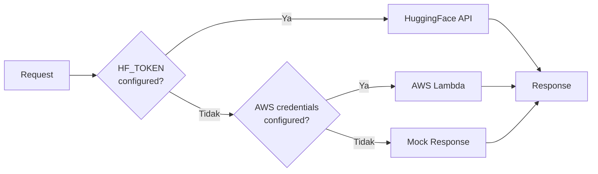

# 🤖 Setup AWS Lambda (AI Service)

Deploy Python AI service ke AWS Lambda untuk OCR dan chat functionality.

---

## 📑 Daftar Isi

1. [Overview](#overview)
2. [AI Fallback Mechanism](#ai-fallback-mechanism) ← **BARU**
3. [Persiapan](#1-persiapan)
4. [Create Lambda Function](#2-create-lambda-function)
5. [Deploy Code](#3-deploy-code)
6. [Konfigurasi Function URL](#4-konfigurasi-function-url)
7. [Connect ke Backend](#5-connect-ke-backend)
8. [Troubleshooting](#6-troubleshooting)

---

## Overview

### Mengapa Lambda untuk AI?

| Aspek | AI di EC2 | AWS Lambda |
|-------|-----------|------------|
| **Biaya** | Bayar 24/7 | Pay per request |
| **Scaling** | Manual | ✅ Auto-scaling |
| **Cold Start** | Tidak ada | ⚠️ 1-3 detik |
| **Maintenance** | Manual | ✅ Managed |
| **Max Runtime** | Unlimited | 15 menit |
| **Memory** | EC2 limit | 128MB - 10GB |

**Kesimpulan:** Lambda cocok untuk AI inference yang bersifat on-demand.

### Arsitektur AI Service

```
Frontend ──► Backend (Go) ──► AWS Lambda ──► HuggingFace API
                                   │
                                   ├── health   (Status check)
                                   ├── ocr      (Donut model)
                                   ├── chat     (Qwen-72B + Age personalization)
                                   ├── categorize (BART zero-shot)
                                   └── insight  (Spending analysis)
```

### Available Actions

| Action | Description | Input | Output |
|--------|-------------|-------|--------|
| `health` | Status check | - | Service info, model names |
| `ocr` | Extract text from receipt | `image_url` atau `image_base64` | Vendor, date, items, total |
| `chat` | Financial assistant | `message`, `context`, `user_age` | Reply, suggestions |
| `categorize` | Auto-categorize transaction | `description` | Category, confidence |
| `insight` | Spending insights | `transactions` array | Insights, summary |

---

## AI Fallback Mechanism

Backend secara otomatis memilih AI provider dengan prioritas berikut:



### Priority Order

| Priority | Provider | Env Variables Required |
|----------|----------|------------------------|
| 1️⃣ | **HuggingFace** | `HF_TOKEN` |
| 2️⃣ | **AWS Lambda** | `AWS_ACCESS_KEY_ID`, `AWS_SECRET_ACCESS_KEY`, `LAMBDA_FUNCTION_NAME` |
| 3️⃣ | **Mock** | *(none - fallback)* |

### Response Field

Setiap response AI endpoint akan menyertakan:

```json
{
  "ai_enabled": true,      // true jika HuggingFace atau Lambda aktif
  "ai_provider": "lambda"  // "huggingface", "lambda", atau "mock"
}
```

### Kapan Menggunakan Lambda vs HuggingFace?

| Situasi | Rekomendasi |
|---------|-------------|
| Development/Testing | Mock (tanpa env) |
| Production budget rendah | Lambda (pay-per-use) |
| Production high-traffic | HuggingFace (faster) |
| HuggingFace rate-limited | Lambda sebagai backup |

> **💡 Tip:** Jika tidak ingin setup Lambda, cukup set `HF_TOKEN` saja. Lambda hanya digunakan jika HuggingFace tidak dikonfigurasi.

---

## 1. Persiapan

### Step 1.1: Pastikan AI Service Ready

Cek folder `ai-service/`:
```bash
ls ai-service/
# lambda_function.py   ← Main handler
# requirements.txt     ← Dependencies
# README.md
# serverless.yml       ← Serverless Framework config (optional)
```

### Step 1.2: HuggingFace Token

1. Login ke [huggingface.co](https://huggingface.co)
2. Profile → Settings → Access Tokens
3. Create new token (Read permission)
4. Copy token: `hf_xxxxxxxx`

---

## 2. Create Lambda Function

### Step 2.1: Buka Lambda Console

AWS Console → Search **Lambda** → Click

### Step 2.2: Create Function

1. Click **Create function**
2. Pilih **Author from scratch**
3. Konfigurasi:

```
Function name: finlapor-ai
Runtime: Python 3.11
Architecture: x86_64

Permissions:
  Execution role: Create a new role with basic Lambda permissions
```

4. Click **Create function**

### Step 2.3: Konfigurasi Umum

1. Tab **Configuration**
2. **General configuration** → Edit:

```
Memory: 512 MB (atau lebih untuk model besar)
Timeout: 30 seconds (OCR bisa lambat)
```

3. Save

### Step 2.4: Environment Variables

1. **Configuration** → **Environment variables** → Edit
2. Tambahkan:

| Key | Value | Keterangan |
|-----|-------|------------|
| `HF_TOKEN` | `hf_xxxxxxxx` | HuggingFace API token |
| `HF_LLM_MODEL` | `Qwen/Qwen2.5-72B-Instruct` | Model untuk chat |
| `HF_OCR_MODEL` | `naver-clova-ix/donut-base-finetuned-cord-v2` | Model untuk OCR |

3. Save

---

## 3. Deploy Code

### Metode 1: Upload ZIP (Simple)

**Step 3.1: Buat deployment package di local:**

```bash
cd ai-service

# Create package directory
mkdir -p package

# Install dependencies
pip install -r requirements.txt -t package/

# Copy source code (hanya lambda_function.py, tidak ada folder handlers)
cp lambda_function.py package/

# Create ZIP
cd package
zip -r ../deployment.zip .
cd ..

# Hasil: deployment.zip (~1 MB karena hanya requests library)
```

**Step 3.2: Upload ke Lambda:**

1. Lambda Console → Function `finlapor-ai`
2. **Code** tab
3. **Upload from** → **.zip file**
4. Upload `deployment.zip`
5. Save

### Metode 2: Container Image (Advanced)

Untuk dependencies besar, gunakan container:

**Dockerfile:**
```dockerfile
FROM public.ecr.aws/lambda/python:3.11

COPY requirements.txt ${LAMBDA_TASK_ROOT}
RUN pip install -r requirements.txt

COPY lambda_function.py ${LAMBDA_TASK_ROOT}

CMD ["lambda_function.lambda_handler"]
```

**Build dan push ke ECR:**
```bash
# Login ke ECR
aws ecr get-login-password --region ap-southeast-1 | \
  docker login --username AWS --password-stdin [ACCOUNT_ID].dkr.ecr.ap-southeast-1.amazonaws.com

# Create repository
aws ecr create-repository --repository-name finlapor-ai

# Build
docker build -t finlapor-ai .

# Tag dan push
docker tag finlapor-ai:latest [ACCOUNT_ID].dkr.ecr.ap-southeast-1.amazonaws.com/finlapor-ai:latest
docker push [ACCOUNT_ID].dkr.ecr.ap-southeast-1.amazonaws.com/finlapor-ai:latest
```

---

## 4. Konfigurasi Function URL

Lambda Function URL memungkinkan akses langsung via HTTPS tanpa API Gateway.

### Step 4.1: Create Function URL

1. Lambda Console → Function `finlapor-ai`
2. **Configuration** → **Function URL**
3. Click **Create function URL**
4. Konfigurasi:

```
Auth type: NONE (untuk testing) atau IAM (production)
CORS:
  Allow origin: https://finlapor.airi.click, http://localhost:3000
  Allow methods: POST, OPTIONS
  Allow headers: content-type
```

5. Save

### Step 4.2: Copy Function URL

URL format: `https://xxxxxx.lambda-url.ap-southeast-1.on.aws/`

---

## 5. Connect ke Backend

Backend menggunakan **AWS SDK** untuk memanggil Lambda secara langsung (bukan via Function URL).

### Step 5.1: Update Backend Environment

Gunakan **credentials dari IAM user `finlapor-admin`** yang sudah dibuat di [02. AWS Account Setup](./02-aws-account-setup.md).

> **📝 Note:** User `finlapor-admin` sudah memiliki policy `AWSLambda_FullAccess` yang mencakup permission `lambda:InvokeFunction`.

Di EC2, update `backend/.env`:

```bash
# Lambda Configuration (AWS SDK method)
LAMBDA_FUNCTION_NAME=finlapor-ai
AWS_REGION=ap-southeast-1
AWS_ACCESS_KEY_ID=AKIA...        # dari finlapor-admin (02-aws-account-setup.md)
AWS_SECRET_ACCESS_KEY=xxxxx...   # dari finlapor-admin (02-aws-account-setup.md)
```

### Step 5.2: Verifikasi Koneksi Backend ke Lambda

**Metode 1: Cek log saat Backend start**

Restart backend dan cek log:
```bash
# Restart backend
cd ~/finlapor
docker compose restart backend

# Cek log
docker compose logs backend | grep -i lambda

# Expected output jika berhasil:
# ✅ Lambda service initialized: finlapor-ai (region: ap-southeast-1)

# Jika gagal (credentials tidak ada/salah):
# ⚠️ AWS credentials not configured, Lambda service disabled
```

**Metode 2: Test via Backend API**

Setelah backend running, test endpoint yang menggunakan Lambda:
```bash
# Test AI Chat (memerlukan login terlebih dahulu)
curl -X POST http://localhost:8080/api/ai/chat \
  -H "Content-Type: application/json" \
  -H "Authorization: Bearer YOUR_JWT_TOKEN" \
  -d '{"message": "Halo"}'

# Expected response jika Lambda connected:
# {"response": "Halo! Ada yang bisa saya bantu..."}

# Jika Lambda tidak connected:
# {"error": "lambda service not configured"}
```

**Metode 3: Test Lambda langsung via AWS CLI (di Bastion)**
```bash
# Di Bastion (yang punya internet)
aws lambda invoke \
  --function-name finlapor-ai \
  --payload '{"action": "health"}' \
  --cli-binary-format raw-in-base64-out \
  response.json

cat response.json
# Expected: {"statusCode": 200, "body": "{\"status\":\"ok\",...}"}
```

### Step 5.3: Cara Kerja (Reference)

Backend menggunakan AWS SDK untuk invoke Lambda:

```go
// internal/services/lambda.go
func (s *LambdaService) Invoke(ctx context.Context, req *LambdaRequest) (*LambdaResponse, error) {
    result, err := s.client.Invoke(ctx, &lambda.InvokeInput{
        FunctionName: aws.String(s.functionName),  // "finlapor-ai"
        Payload:      payload,
    })
    // ...
}
```

> **📝 Note:** Function URL tetap berguna untuk testing via curl/Postman, 
> tapi backend production menggunakan AWS SDK karena lebih cepat dan aman.

### Step 5.4: Test Endpoints (via Function URL)

```bash
# 1. Test Health
curl -X POST https://xxxxxx.lambda-url.ap-southeast-1.on.aws/ \
  -H "Content-Type: application/json" \
  -d '{"action": "health"}'

# Expected:
{
  "statusCode": 200,
  "body": "{\"status\":\"ok\",\"service\":\"finlapor-ai\",\"version\":\"2.0\",\"hf_configured\":true,\"models\":{\"ocr\":\"naver-clova-ix/donut-base-finetuned-cord-v2\",\"llm\":\"Qwen/Qwen2.5-72B-Instruct\"}}"
}

# 2. Test Chat
curl -X POST https://xxxxxx.lambda-url.ap-southeast-1.on.aws/ \
  -H "Content-Type: application/json" \
  -d '{"action": "chat", "message": "Halo", "user_age": 25}'

# 3. Test Categorize
curl -X POST https://xxxxxx.lambda-url.ap-southeast-1.on.aws/ \
  -H "Content-Type: application/json" \
  -d '{"action": "categorize", "description": "Makan siang di KFC"}'

# Expected: {"statusCode": 200, "body": "{\"category\":\"Makanan\",\"confidence\":0.85}"}
```

---

## 6. Koneksi Lambda dari Private Subnet

> **⚠️ PENTING:** Backend di **Private Subnet tidak bisa langsung** memanggil AWS Lambda karena tidak ada akses internet ke AWS API endpoints.

### 6.1 Mengapa Timeout?

```
┌─────────────────────────────────────────────────────────────────┐
│                         AWS Cloud                               │
│  ┌─────────────────────────────────────────────────────────┐   │
│  │                    finlapor-vpc                          │   │
│  │                                                          │   │
│  │  ┌──────────────────┐    ┌──────────────────────────┐   │   │
│  │  │  Private Subnet  │    │     Public Subnet        │   │   │
│  │  │                  │    │                          │   │   │
│  │  │  ┌────────────┐  │    │  ┌──────────────────┐   │   │   │
│  │  │  │  Backend   │──┼────┼──│ Internet Gateway │───┼───┼───│──► AWS Lambda API
│  │  │  │    EC2     │  │    │  └──────────────────┘   │   │   │    (BLOCKED!)
│  │  │  └────────────┘  │    │                          │   │   │
│  │  │       │          │    │                          │   │   │
│  │  │       ▼          │    │                          │   │   │
│  │  │  ┌────────────┐  │    │                          │   │   │
│  │  │  │    RDS     │  │    │                          │   │   │
│  │  │  │ (Internal) │  │    │                          │   │   │
│  │  │  └────────────┘  │    │                          │   │   │
│  │  └──────────────────┘    └──────────────────────────┘   │   │
│  └─────────────────────────────────────────────────────────┘   │
└─────────────────────────────────────────────────────────────────┘

❌ Private Subnet TIDAK punya route ke Internet Gateway
   → Tidak bisa reach AWS Lambda API endpoints
   → Hasil: Connection timeout
```

### 6.2 Solusi

Ada 3 opsi untuk menghubungkan Backend di Private Subnet ke Lambda:

| Opsi | Biaya/bulan | Kompleksitas | Keamanan | Rekomendasi |
|------|-------------|--------------|----------|-------------|
| **A. VPC Endpoint** | ~$7.5 | Medium | ✅ Tinggi | Production |
| **B. NAT Gateway** | ~$32+ | Medium | ✅ Tinggi | Enterprise |
| **C. Public Subnet** | $0 | Rendah | ⚠️ Perlu SG ketat | **Demo/UAS** |

---

### Opsi A: VPC Endpoint untuk Lambda (Recommended untuk Production)

VPC Endpoint memungkinkan akses ke AWS services tanpa keluar VPC.

```
┌─────────────────────────────────────────────────────────────────┐
│                         AWS Cloud                               │
│  ┌─────────────────────────────────────────────────────────┐   │
│  │                    finlapor-vpc                          │   │
│  │                                                          │   │
│  │  ┌──────────────────┐         ┌───────────────────┐     │   │
│  │  │  Private Subnet  │         │   VPC Endpoint    │     │   │
│  │  │                  │         │   (Lambda)        │     │   │
│  │  │  ┌────────────┐  │         │                   │     │   │
│  │  │  │  Backend   │──┼────────▶│ ────────────────▶ │─────┼───│──► AWS Lambda API
│  │  │  │    EC2     │  │ Private │                   │     │   │    ✅ BERHASIL!
│  │  │  └────────────┘  │  Link   └───────────────────┘     │   │
│  │  └──────────────────┘                                    │   │
│  └─────────────────────────────────────────────────────────┘   │
└─────────────────────────────────────────────────────────────────┘
```

**Biaya:** ~$7.5/bulan per endpoint

#### Step-by-step Setup VPC Endpoint:

**Step 1: Buka VPC Console**
```
AWS Console → VPC → Endpoints (sidebar kiri) → Create endpoint
```

**Step 2: Konfigurasi Endpoint**
```
Name tag: finlapor-lambda-endpoint
Service category: ☑ AWS services
Services: Cari "lambda" → pilih com.amazonaws.ap-southeast-1.lambda
VPC: finlapor-vpc (atau finlapor-vpc-secure)
```

**Step 3: Pilih Subnets**
```
Availability Zone: ap-southeast-1a (atau sesuai private subnet Anda)
Subnet ID: Pilih Private Subnet (contoh: subnet-xxxxxx | finlapor-private-1)
```

**Step 4: Security Group**
```
finlapor-lambda-enpoint-sg:
Inbound
┌──────────┬──────────┬───────────────────────────────┬─────────────────────┐
│ Type     │ Port     │ Source                        │ Description         │
├──────────┼──────────┼───────────────────────────────┼─────────────────────┤
│ HTTP     │ 443      │ finlapor-backend-private-sg   │ Backend to Lamda    │
│          │          │ atau                          │                     │
│          │          │ 10.0.0.0/16                   │                     │
└──────────┴──────────┴───────────────────────────────┴─────────────────────┘

Outbound
┌────────────┬──────────┬────────────┬──────────────┐
│ Type       │ Port     │ Source     │ Description  │
├────────────┼──────────┼────────────┼──────────────┤
│ All Trapic │ 443      │ 0.0.0.0/0  │              │
└────────────┴──────────┴────────────┴──────────────┘
```

**Step 5: Policy**
```
☑ Full access (untuk testing)
```

**Step 6: Create endpoint**

Tunggu status berubah dari "Pending" ke "Available" (~2-5 menit)

#### Verifikasi VPC Endpoint:

```bash
# SSH ke Backend EC2
ssh finlapor-backend

# Test koneksi ke Lambda via endpoint
# Set AWS credentials dulu
export AWS_ACCESS_KEY_ID=AKIA...
export AWS_SECRET_ACCESS_KEY=xxxxx...
export AWS_REGION=ap-southeast-1

# Invoke Lambda
aws lambda invoke \
  --function-name finlapor-ai \
  --payload '{"action": "health"}' \
  --cli-binary-format raw-in-base64-out \
  response.json

cat response.json
# Expected: {"statusCode": 200, "body": "{\"status\":\"ok\",...}"}
```

#### 🧪 Test Connection Lengkap (Backend → Lambda via VPC Endpoint)

Sebelum menggunakan Lambda dari backend, pastikan koneksi via VPC Endpoint sudah benar.

**1. Test DNS Resolution:**
```bash
# SSH ke Backend EC2
ssh finlapor-backend

# Cek apakah DNS Lambda endpoint bisa di-resolve
nslookup lambda.ap-southeast-1.amazonaws.com

# Expected: Menampilkan IP private (10.x.x.x) dari VPC Endpoint
# Jika menampilkan IP public, VPC Endpoint belum aktif
```

**2. Test Port 443 (HTTPS) ke Lambda Endpoint:**
```bash
# Test koneksi TCP ke Lambda endpoint
nc -zv lambda.ap-southeast-1.amazonaws.com 443

# Expected: Connection to lambda.ap-southeast-1.amazonaws.com 443 port [tcp/https] succeeded!
```

**3. Test AWS CLI Lambda Access:**
```bash
# Set credentials
export AWS_ACCESS_KEY_ID=AKIAXXXXXXXX
export AWS_SECRET_ACCESS_KEY=xxxxxxxxxxxxxxxx
export AWS_REGION=ap-southeast-1

# List Lambda functions (test basic access)
aws lambda list-functions --max-items 5

# Expected: Menampilkan list Lambda functions
```

**4. Test Invoke Lambda Function:**
```bash
# Test health check
aws lambda invoke \
  --function-name finlapor-ai \
  --payload '{"action": "health"}' \
  --cli-binary-format raw-in-base64-out \
  /tmp/lambda-response.json

cat /tmp/lambda-response.json
# Expected: {"statusCode": 200, "body": "{\"status\":\"ok\",\"service\":\"finlapor-ai\"...}"}
```

**5. Test dari Dalam Docker Container:**
```bash
# Masuk ke container backend
docker exec -it finlapor-backend-1 sh

# Test dengan curl (jika ada)
# Atau test dengan wget
wget -qO- --timeout=10 https://lambda.ap-southeast-1.amazonaws.com 2>&1 | head -5

# Expected: Menampilkan response (bisa error auth, tapi koneksi berhasil)
```

**6. Test Full Integration (via Backend API):**
```bash
# Dari dalam EC2, bukan container

# 1. Login untuk dapat token
TOKEN=$(curl -s -X POST http://localhost:8080/api/auth/login \
  -H "Content-Type: application/json" \
  -d '{"email":"YOUR_EMAIL","password":"YOUR_PASSWORD"}' | jq -r '.token')

# 2. Test AI Chat (akan memanggil Lambda)
curl -X POST http://localhost:8080/api/chat \
  -H "Authorization: Bearer $TOKEN" \
  -H "Content-Type: application/json" \
  -d '{"message":"Halo, apa itu FinLapor?"}'

# Expected: {"response": "..."}
# Jika error: {"error": "lambda invocation failed..." }
```

#### Troubleshooting VPC Endpoint:

| Gejala | Penyebab | Solusi |
|--------|----------|--------|
| `nslookup` menampilkan IP public | VPC Endpoint tidak aktif | Pastikan "Enable Private DNS" dicentang |
| `Connection refused` port 443 | Security Group salah | Allow HTTPS (443) dari EC2 Security Group |
| `UnrecognizedClientException` | Credentials salah | Cek AWS_ACCESS_KEY_ID dan AWS_SECRET_ACCESS_KEY |
| `ResourceNotFoundException` | Lambda function tidak ada | Deploy Lambda function dulu |
| Timeout dari Docker | Container tidak bisa akses VPC | Pastikan Docker network mode correct |

---


### Opsi B: NAT Gateway

NAT Gateway memberikan akses internet ke private subnet untuk SEMUA traffic.

```
┌─────────────────────────────────────────────────────────────────┐
│                         AWS Cloud                               │
│  ┌─────────────────────────────────────────────────────────┐   │
│  │                    finlapor-vpc                          │   │
│  │                                                          │   │
│  │  ┌──────────────────┐    ┌──────────────────────────┐   │   │
│  │  │  Private Subnet  │    │     Public Subnet        │   │   │
│  │  │                  │    │                          │   │   │
│  │  │  ┌────────────┐  │    │  ┌──────────────────┐   │   │   │
│  │  │  │  Backend   │──┼───▶┼──│  NAT Gateway     │───┼───┼───│──► Internet
│  │  │  │    EC2     │  │    │  └──────────────────┘   │   │   │    ✅ BERHASIL!
│  │  │  └────────────┘  │    │          │              │   │   │
│  │  └──────────────────┘    │          ▼              │   │   │
│  │                          │  ┌──────────────────┐   │   │   │
│  │                          │  │ Internet Gateway │   │   │   │
│  │                          │  └──────────────────┘   │   │   │
│  │                          └──────────────────────────┘   │   │
│  └─────────────────────────────────────────────────────────┘   │
└─────────────────────────────────────────────────────────────────┘
```

**Biaya:** ~$32/bulan + $0.045/GB data transfer

#### Step-by-step Setup NAT Gateway:

**Step 1: Allocate Elastic IP**
```
AWS Console → VPC → Elastic IPs → Allocate Elastic IP address
Network Border Group: ap-southeast-1
Allocate
```

**Step 2: Create NAT Gateway**
```
AWS Console → VPC → NAT Gateways → Create NAT gateway

Name: finlapor-nat
Subnet: Pilih PUBLIC Subnet (bukan private!)
Connectivity type: Public
Elastic IP allocation ID: Pilih yang baru diallocate
Create NAT gateway
```

Tunggu status "Available" (~2-5 menit)

**Step 3: Update Route Table Private Subnet**
```
VPC → Route Tables → Pilih route table untuk Private Subnet
Tab "Routes" → Edit routes → Add route

Destination: 0.0.0.0/0
Target: NAT Gateway → pilih finlapor-nat

Save changes
```

#### Verifikasi NAT Gateway:

```bash
# SSH ke Backend EC2 (private subnet)
ssh finlapor-backend

# Test akses internet
curl -I https://www.google.com
# Expected: HTTP/2 200

# Test akses Lambda API
curl -I https://lambda.ap-southeast-1.amazonaws.com
# Expected: HTTP/2 403 (forbidden karena perlu credentials, tapi artinya bisa reach)

# Test invoke Lambda
aws lambda invoke \
  --function-name finlapor-ai \
  --payload '{"action": "health"}' \
  --cli-binary-format raw-in-base64-out \
  response.json

cat response.json
# Expected: {"statusCode": 200, "body": "{\"status\":\"ok\",...}"}
```

---

### Opsi C: Pindahkan Backend ke Public Subnet (Budget Friendly - Recommended untuk UAS)

Untuk **demo/UAS** dengan budget terbatas, deploy backend di public subnet.

```
┌─────────────────────────────────────────────────────────────────┐
│                         AWS Cloud                               │
│  ┌─────────────────────────────────────────────────────────┐   │
│  │                    finlapor-vpc                          │   │
│  │                                                          │   │
│  │  ┌──────────────────┐    ┌──────────────────────────┐   │   │
│  │  │  Private Subnet  │    │     Public Subnet        │   │   │
│  │  │                  │    │                          │   │   │
│  │  │  ┌────────────┐  │    │  ┌────────────┐          │   │   │
│  │  │  │    RDS     │◀─┼────┼──│  Backend   │──────────┼───┼───│──► AWS Lambda API
│  │  │  │            │  │    │  │    EC2     │          │   │   │    ✅ BERHASIL!
│  │  │  └────────────┘  │    │  └────────────┘          │   │   │
│  │  └──────────────────┘    │          │               │   │   │
│  │                          │          ▼               │   │   │
│  │                          │  ┌──────────────────┐    │   │   │
│  │                          │  │ Internet Gateway │    │   │   │
│  │                          │  └──────────────────┘    │   │   │
│  │                          └──────────────────────────┘   │   │
│  └─────────────────────────────────────────────────────────┘   │
└─────────────────────────────────────────────────────────────────┘
```

**Biaya:** $0 tambahan

#### Step-by-step: Launch Backend di Public Subnet

**Step 1: Launch EC2 di Public Subnet**
```
EC2 Console → Launch Instance

Name: finlapor-backend-public
AMI: Ubuntu 24.04 LTS
Instance type: t2.micro (free tier) atau t3.small
Key pair: finlapor-key

Network settings:
  VPC: finlapor-vpc
  Subnet: Pilih PUBLIC Subnet
  Auto-assign public IP: Enable
  Security group: Create or select existing
```

**Step 2: Security Group (PENTING!)**
```
Security Group: finlapor-backend-public-sg

Inbound rules:
- Type: SSH, Port: 22, Source: Your IP only (x.x.x.x/32)
- Type: Custom TCP, Port: 8080, Source: CloudFlare IPs (103.21.244.0/22, dll)
  ATAU Source: 0.0.0.0/0 untuk testing

Outbound rules:
- Type: All traffic, Destination: 0.0.0.0/0
```

> **⚠️ Security:** Jangan buka port 22 ke 0.0.0.0/0. Gunakan IP Anda saja atau Bastion.

**Step 3: Setup Backend (sama seperti di Private Subnet)**
```bash
# SSH ke EC2 Public
ssh -i finlapor-key.pem ubuntu@[PUBLIC_IP]

# Clone repo
git clone https://github.com/aan-andiyanaS/finlapor.git
cd finlapor

# Setup .env
nano backend/.env
# Isi environment variables...

# Jalankan dengan Docker
docker compose up -d
```

**Step 4: Update Security Group RDS**
```
RDS Security Group → Edit inbound rules:
Add: PostgreSQL (5432) dari finlapor-backend-public-sg
```

#### Verifikasi:

```bash
# Di EC2 Public Subnet
# Test akses Lambda
curl -X POST https://YOUR_LAMBDA_URL.lambda-url.ap-southeast-1.on.aws/ \
  -H "Content-Type: application/json" \
  -d '{"action": "health"}'

# Expected: {"statusCode": 200, "body": "{\"status\":\"ok\",...}"}

# Test via Backend API
curl http://localhost:8080/health
# Expected: {"status": "ok", ...}
```

---

### 6.3 Perbandingan Detail

| Aspek | VPC Endpoint | NAT Gateway | Public Subnet |
|-------|-------------|-------------|---------------|
| **Biaya/bulan** | ~$7.5 | ~$32+ | $0 |
| **Setup time** | 10 menit | 15 menit | 30 menit |
| **Keamanan** | ✅ Sangat aman | ✅ Aman | ⚠️ Perlu SG ketat |
| **Maintenance** | Rendah | Rendah | Perlu monitoring |
| **Scope akses** | Hanya Lambda | Semua internet | Semua internet |
| **Best for** | Production | Enterprise | Demo/UAS |

> **💡 Rekomendasi untuk UAS:** Gunakan **Opsi C (Public Subnet)** untuk menghemat biaya. Pastikan Security Group dikonfigurasi dengan benar untuk keamanan.

---

## 7. Troubleshooting

> **📖 Lihat juga:** [Troubleshooting Guide](../troubleshooting.md) untuk panduan umum test koneksi dan debugging.

### Error: Task timed out


**Gejala:**
```
Task timed out after 3.00 seconds
```

**Solusi:**
1. Lambda Console → Configuration → General configuration
2. Increase timeout (coba 30s atau 60s)
3. Untuk model besar, tingkatkan memory juga

### Error: Module not found

**Gejala:**
```
Unable to import module 'lambda_function': No module named 'xxx'
```

**Solusi:**
1. Pastikan semua dependencies ada di `requirements.txt`
2. Rebuild deployment package
3. Reupload ZIP

### Error: Out of memory

**Gejala:**
```
Runtime exited with error: signal: killed
```

**Solusi:**
1. Lambda Console → Configuration → General configuration
2. Increase memory (coba 1024 MB atau lebih)

### Error: HuggingFace rate limit

**Gejala:**
```
Rate limit reached
```

**Solusi:**
1. Upgrade HuggingFace plan (Pro)
2. Atau implement caching di backend
3. Atau reduce request frequency

### CORS Error

**Gejala:**
```
Access-Control-Allow-Origin header missing
```

**Solusi:**
1. Lambda console → Function URL → CORS configuration
2. Pastikan Allow Origin include frontend domain
3. Atau handle CORS di Lambda code:

```python
def handler(event, context):
    return {
        'statusCode': 200,
        'headers': {
            'Access-Control-Allow-Origin': '*',
            'Access-Control-Allow-Methods': 'POST, OPTIONS',
            'Access-Control-Allow-Headers': 'Content-Type'
        },
        'body': json.dumps(result)
    }
```

### Cold Start lambat

**Gejala:** Response pertama lambat (5-10 detik)

**Mitigasi:**
1. Provisioned Concurrency (berbayar)
2. Atau keep Lambda warm dengan scheduled event
3. Atau reduce package size

---

## Advanced: API Gateway (Opsional)

Untuk production dengan rate limiting dan auth:

### Step: Create HTTP API

1. API Gateway Console → **Create API**
2. Pilih **HTTP API**
3. Integrations: **Add integration** → Lambda
4. Function: `finlapor-ai`
5. Create

### Benefits API Gateway:
- Rate limiting
- API Keys
- Usage plans
- Custom domain
- Request/Response transformation

---

## ✅ Checklist

- [ ] Lambda function `finlapor-ai` dibuat
- [ ] Python 3.11 runtime
- [ ] Memory: 512 MB+
- [ ] Timeout: 30 seconds+
- [ ] HF_TOKEN environment variable set
- [ ] Code deployed (ZIP atau Container)
- [ ] Function URL created
- [ ] CORS configured
- [ ] Test endpoint working
- [ ] Backend .env updated dengan Lambda URL

---

## Next Step

Lanjut ke → [08. CloudFlare Setup](./08-cloudflare-setup.md)
